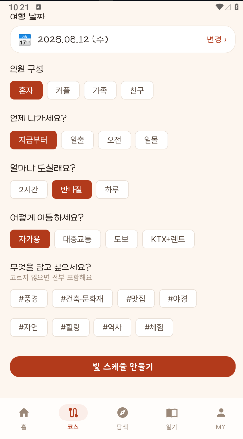
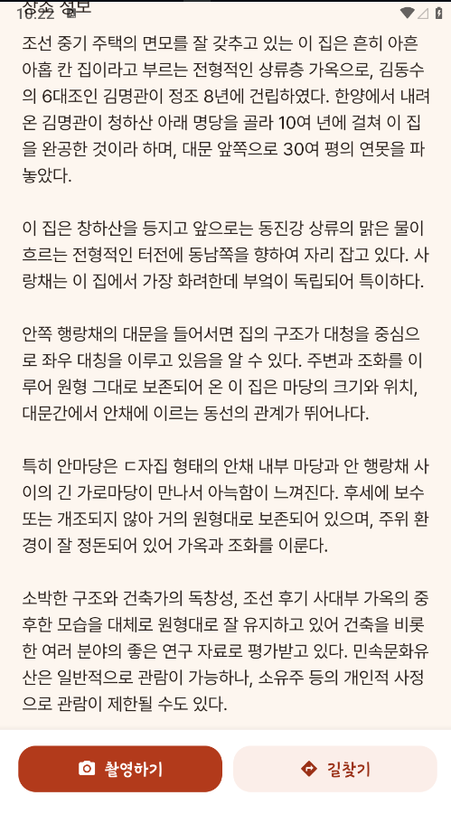

# 📸 정읍 시선 (PicView)

> **"지금 정읍에서, 어디를 어떻게 담을까"**
> 실시간 기상·천문 데이터로 촬영 적기를 계산하는 지역 특화 출사(出寫) 안내 앱

『2026 관광데이터 활용 공모전』 출품작 · Android Native

<p align="center">
  
  
  
</p>

---

## 왜 만들었나

관광 앱은 많습니다. 대부분 **"어디를 갈까"** 까지 답하고 끝납니다.

그런데 사진을 찍으러 가는 사람에게는 그것으로 부족합니다. 같은 내장산이라도
한낮에 가면 빛이 강해 평범한 사진이 나오고, 일몰 30분 전에 가면 단풍이
역광으로 투명하게 빛납니다. **어디를 갈지보다 언제 갈지가 사진을 결정합니다.**

정읍 시선은 **"지금 어디를, 언제, 어떻게 담을까"** 까지 답합니다.

### 왜 정읍인가

정읍은 내장산 단풍철에 관광객이 몰리고 나머지 계절에는 비는 곳입니다.
그런데 출사의 관점으로 보면 정읍에는 사계절이 다 있습니다 — 봄 벚꽃,
여름 계곡, 가을 단풍과 구절초, 겨울 설경. 문제는 **"지금 뭐가 볼 만한지"를
알 방법이 없다는 것**입니다.

그래서 이 앱은 축제 일정이 아니라 **피사체의 절정 시기**를 기준으로 만들었습니다.
(관광공사 API 에 등록된 정읍 축제가 2026년 기준 0건인 현실적 이유도 있습니다)

---

## 핵심 아이디어 — 빛을 계산한다

이 앱의 모든 기능은 **하나의 계산**에서 나옵니다.

```
한국천문연구원 일출·일몰  ─┐
기상청 초단기실황 (기온·강수) ─┼─→  지금의 빛 구간(LightPhase)  ─→  모든 화면
촬영지의 방위·최적 시간대  ─┘         (새벽·일출·오전·한낮·오후·일몰·저녁·야간)
```

이 값 하나가 홈의 인사말, 촬영지 점수, 코스 배치, 포즈 추천을 전부 바꿉니다.
**같은 장소가 시간에 따라 다른 점수를 받고, 같은 포즈가 시간에 따라 순위가
바뀝니다.**

> 전부 결정론적 계산입니다. LLM 은 여기서 나온 결과를 설명하는 문장만 씁니다.
> 그래서 네트워크가 끊기거나 LLM 이 실패해도 추천 자체는 항상 나옵니다.

---

## 화면별 기능

### 1. 홈 — 지금 나가야 하나


앱을 여는 이유는 하나입니다. **지금 나가야 하는지 아닌지.**
그래서 첫 화면이 그 답부터 합니다.

- **지금의 빛** — 현재 구간과 한 줄 조언(`야간 · 삼각대가 필요해요`)
- **다음 골든아워까지** 남은 시간 카운트다운
- **하루의 빛 흐름 막대** — 일출부터 일몰까지를 색으로 깔고 현재 위치를 표시.
  "언제가 좋은 시간인지"가 글이 아니라 그림으로 보입니다
- **현재 촬영 조건 3칸** — 기온 / 빛 상태 / 촬영지 수
- **빠른 이동 타일 4개** — 빛 스케줄 · 지도 · 캘린더 · 미션
- **지금 찍기 좋은 곳** — 포토스코어 순 가로 목록

<br clear="right" />

### 2. 포토스코어 — 왜 이 점수인지 보여준다


추천 점수는 **근거가 보여야 신뢰**가 생깁니다. 항목별로 펼쳐 보여 줍니다.

| 항목 | 배점 | 무엇을 보는가 |
|---|---|---|
| 빛 구간 적합 | 6~26 | 지금 빛이 **이 장소의** 최적 시간대와 맞는가 |
| 방위 적합 | 0~16 | 해가 있는 쪽과 장소가 바라보는 쪽 (역광·실루엣) |
| 계절 적합 | 0~18 | 단풍·구절초 같은 피사체가 지금 절정인가 |
| 날씨 | -18~+10 | 비·흐림. 실내는 비가 오히려 유리 |
| 소재 폭 | 12~20 | 풍경·인물·접사 중 몇 가지가 되는가 |
| 머무는 여건 | 0~6 | 빛을 기다릴 수 있는 기온인가 |
| 접근성 | 1~4 | 사진 품질이 아니라 실행 가능성 |

> **설계 기록.** 초기 버전은 100점 중 사진과 직결된 항목이 빛 20점뿐이었고,
> 나머지는 *관광공사 정보 갱신일*(10점), *API 에 대표 사진이 있는지*(4점) 같은
> 데이터 품질 지표였습니다. 그래서 점수 근거로 "정보가 최근에 갱신됐어요"가
> 나왔습니다. 사진이 잘 나오는지와 무관한 문장입니다.
> 앱이 이미 갖고 있던 촬영 특성(방위·최적 시간대)과 계절 절정기를 점수의
> 중심으로 옮겼습니다.

<br clear="right" />

### 3. 빛 스케줄 코스 — 골든아워를 먼저 예약한다

<p>
  
  
</p>

일반 여행 코스는 "영업시간 안에 몇 군데를 넣을까"의 문제입니다.
출사 코스는 **"빛을 언제 어디서 받을까"** 의 문제라 순서가 반대입니다.

1. **골든아워 슬롯을 먼저 예약** — 하루에 두 번뿐이고 30분씩밖에 없습니다
2. 그 슬롯에 **방위가 맞는 곳**을 꽂습니다 (일출↔동향, 일몰↔서향)
3. **한낮에는 실내**를 넣어 강한 빛을 피합니다
4. 남은 시간을 포토스코어·이동거리로 채웁니다

입력 항목:

- **여행 날짜** — 고른 날짜의 일출·일몰을 천문 API 로 다시 받아옵니다.
  정읍 일몰은 8월 19:26, 12월 17:21 로 두 시간 넘게 차이 나서, 오늘 값을
  재사용하면 골든아워 슬롯이 통째로 어긋납니다
- **인원 구성**(혼자·커플·가족·친구) — 체류 시간 배수로 반영. 여럿이면
  한 곳에 오래 머물러 도는 곳이 줄어드는 것이 실제와 맞습니다
- **시간대 · 소요 시간 · 이동 수단**(자가용·대중교통·도보·KTX+렌트)
- **스타일 태그 8종** — #풍경 #건축·문화재 #맛집 #야경 #자연 #힐링 #역사 #체험

### 4. 촬영지 탐색 · 지도

<p>
  
  
</p>

- 카테고리 필터, 포토스코어 순 정렬
- **주제별 색 체계** — 자연(초록) · 문화(단풍) · 레포츠(파랑) · 맛집(골든)
- 지도 마커도 **같은 색과 아이콘**을 씁니다. 목록과 지도가 다른 언어를 쓰면
  같은 장소가 화면마다 다르게 보입니다

### 5. 촬영지 상세 — 언제·어디서·어떻게



- **촬영 정보** — 최적 시간대 · 방위 · 추천 구도
- **포토스코어 근거** (위 참조)
- **오디오 가이드** — TTS 낭독, 속도 조절. 큰 글씨 모드에서는 0.85배속
- **장소 정보** — 관광공사 개요를 그대로 뿌리지 않고 다듬습니다.
  HTML 태그를 걷어내고, 두 문장마다 문단을 끊고,
  **촬영에 쓸모 있는 낱말(일출·단풍·전망대 등)에 형광펜**을 칩니다.
  출사하는 사람에게 필요한 건 연혁이 아니라 "언제 무엇이 보이는가"입니다

<br clear="right" />

### 6. 포즈 가이드 — 그래서 어떻게 서지


카메라를 켠 순간 실제로 막히는 지점은 구도가 아니라 **"그래서 어떻게 서지"** 입니다.

- **구도 오버레이** — 삼분할 · 대칭축 · 중앙원 (장소 유형에 따라 자동 선택)
- **포즈 6종** — 뒤돌아 걷기 · 점프샷 · 실루엣 · 앉아서 감상 · 하늘 향해 · 손 프레임
- **인원 선택** — 1인 / 2인 / 3~4인 / 5인+

포즈 점수는 **고정값이 아닙니다.** 지금의 빛 · 장소 방위 · 인원으로 매번
다시 계산합니다.

> 고정값이면 한밤중에도 "실루엣"이 1등으로 뜹니다. 실루엣은 해를 등져야
> 성립하므로 그때는 후순위가 맞습니다. 실제로 **야간에는 뒤로 밀리고
> 일몰 골든아워에는 100점 1위로 올라옵니다.**

<br clear="right" />

### 7. 출사 기록 · 일기


**촬영 → 기록 → 일기 → 공유**가 한 줄로 이어집니다.

- 촬영 화면에서 셔터를 누르면 **자동으로 방문 기록**이 남고 사진이 붙습니다.
  사진을 찍었다는 건 그 자리에 있었다는 뜻이니까요
  (수동 "다녀왔어요" 버튼도 남겨 뒀습니다 — 눈으로만 보고 온 날도 있습니다)
- 하루 단위로 묶여 **일기 초안**이 생성됩니다 (Gemini, 실패 시 템플릿 폴백)
- **그날 찍은 사진 줄**이 함께 붙습니다
- **고치기** — LLM 이 쓴 문장이 사실과 다를 수 있고, 무엇보다 "내 일기"라면
  내가 고칠 수 있어야 합니다

<br clear="right" />

### 8. 포토 프레임


사진은 찍고 끝이 아니라 **남에게 보여 주는 것으로 마무리**됩니다.
그때 "어디서 찍었는지"가 사진에 같이 붙어야 정읍이 알려집니다.

- 폴라로이드 프레임에 **장소명 · 날짜 · 정읍시** 표기
- 테마 4종 — **내장산 단풍 · 무성서원 · 구절초 · 쌍화차 거리**
  (색 이름이 아니라 장소 이름을 씁니다. 고르는 행위가 "어떤 색으로 할까"가
  아니라 "어디서 찍은 사진으로 할까"가 되도록)
- 정사각형 출력 — 인스타그램·카카오톡 어디에 올려도 잘리지 않습니다
- 다른 앱에서 **"공유 → 정읍 시선"** 으로 사진을 보낼 수도 있습니다

<br clear="right" />

### 9. 미션 · 스탬프북


방문 기록만으로 **매번 다시 판정**합니다. 별도 저장소가 없어서
"미션 완료 처리를 깜빡해 배지가 안 나오는" 종류의 버그가 원천적으로 없습니다.

- 미션 6종 — 골든아워 사냥꾼, 정읍 탐험가, 유산 기록자 등
- **스탬프북** — 같은 데이터를 격자로. 목록이 "무엇을 해야 하는지"를
  설명한다면 격자는 "얼마나 모았는지"를 보여 줍니다.
  안 찍힌 자리는 점선 원으로 남겨 **빈 칸이 아니라 채울 자리**로 읽히게 했습니다

> 원안은 "쌍화차 인증" 같은 단순 방문 미션이었는데, **빛 조건**을 판정에
> 넣었습니다. 그래야 "언제 가느냐"가 의미를 갖고, 이 앱이 스탬프 앱이 아니라
> 출사 앱으로 남습니다.

<br clear="right" />

### 10. 사계절 캘린더


축제가 아니라 **피사체의 절정 시기**가 기준입니다.

- 계절 탭 · 월 달력 · 절정 기간에 점 표시
- D-day 안내 (`구절초 개화까지 D-14`)
- 그 시기에 **어떻게 찍는지** 한 줄 팁

> 절정 기간이 며칠에 걸쳐 있는지는 목록만으로 감이 오지 않습니다.
> "10월 19~21일"을 읽는 것과 달력에서 그 사흘에 점이 찍힌 걸 보는 것은 다릅니다.

<br clear="right" />

### 11. 큰 글씨 모드 (시니어 접근성)

탭 5개 → 3개, 글자·버튼 확대, TTS 0.85배속.
출사는 은퇴 후 취미로 시작하는 사람이 많은 분야라 접근성을 곁다리로 두지
않았습니다.

---

## 기술 스택

| 레이어 | 기술 |
|---|---|
| 언어 / 최소 SDK | Kotlin · minSdk 26 (Oreo) |
| UI | XML + ViewBinding + Material 3 |
| 아키텍처 | MVVM + Repository |
| 카메라 | CameraX (SurfaceView + Canvas 오버레이) |
| 지도 | Naver Maps Android SDK |
| 네트워크 | Retrofit2 + Coroutines |
| 로컬 저장 | Room (저장한 코스 · 방문 기록 · 일기) |
| 이미지 | Glide |
| 문구 생성 | Gemini API (실패 시 템플릿 폴백) |

**로그인이 없습니다.** 모든 기록이 단말에 남고, 통계는 익명 설치 ID로만 묶입니다.

### 타이포그래피

서체마다 역할을 나눴습니다.

| 자리 | 서체 | 라이선스 |
|---|---|---|
| 제목 · 장소명 · 버튼 | 마포백패킹 | 공공누리 1유형 |
| 소제목 | 이서윤체 | 상업적 이용 가능 |
| 본문 · 라벨 | Pretendard | OFL |
| 일기 | 교보손글씨 2025 | 상업적 이용 가능 |
| 스탬프 배지 | 그리운 체리한스푼 | 상업적 이용 가능 |

---

## 프로젝트 구조

```
app/src/main/java/com/youngs/picview/
├── data/
│   ├── api/          Retrofit 서비스 (관광공사·기상청·천문연·Gemini)
│   ├── model/        API 응답 모델
│   ├── local/        Room 엔티티 · DAO
│   └── repository/   코스·일기 저장소
├── domain/
│   ├── light/        일출·일몰 → 빛 구간 계산
│   ├── course/       출사 코스 생성 엔진
│   ├── score/        포토스코어 7팩터
│   ├── spot/         정읍 촬영지 방위·구도 정보
│   ├── pose/         포즈 추천 (빛·방위·인원 기반)
│   ├── frame/        폴라로이드 합성
│   ├── mission/      미션 판정
│   ├── season/       계절별 촬영 적기
│   └── diary/        출사 일기
├── ui/               화면 (탭 5개 + 큰 글씨 모드 3개)
└── util/             좌표·거리, TTS, MediaStore 저장, 설정
```

---

## 빌드

### 방법 A — 안드로이드 스튜디오

```bash
git clone https://github.com/Young-Seok-Kim/pic-view.git
```

프로젝트를 열면 `local.properties` 가 자동 생성됩니다. 그대로 Run 하면 됩니다.

**API 키 없이도 빌드·실행됩니다.** 키가 없는 기능은 자동으로 폴백합니다.
실제 데이터를 보려면 `local.properties` 에 아래를 추가하세요.

```properties
TOUR_API_KEY=한국관광공사_디코딩_키
NAVER_CLIENT_ID=네이버_지도_클라이언트_ID
NAVER_CLIENT_SECRET=네이버_시크릿
KAKAO_NATIVE_APP_KEY=카카오_네이티브_앱_키
GEMINI_API_KEY=제미나이_키
```

> `local.properties` 는 `.gitignore` 에 있어 커밋되지 않습니다.
> **`.env.example` 에는 실제 키를 넣지 마세요.** 이 파일은 무시 대상이 아닙니다.
> 도커용 실제 키는 `.env`(무시 대상)에 둡니다.

### 방법 B — 커맨드라인

JDK 17 + Android SDK + adb 만 있으면 됩니다.

```bash
./scripts/deploy.sh              # 빌드 → 설치 → 스크린샷
./scripts/deploy.sh --release    # R8 난독화 적용
```

### 방법 C — 도커 (빌드 전용)

```bash
cp .env.example .env
docker compose -f docker/docker-compose.yml build
docker compose -f docker/docker-compose.yml run --rm aab
```

자세한 내용은 **[docker/README.md](docker/README.md)**.

### 테스트

```bash
./gradlew testDebugUnitTest
```

빛 스케줄 계산, 코스 배치 규칙, 미션 판정, 계절 D-day 등 30개.

---

## 데이터 출처

- **한국관광공사 국문 관광정보 서비스** — 촬영지 목록·사진·개요 (실시간 호출)
- **기상청 초단기실황** — 기온·강수
- **한국천문연구원 출몰시각** — 일출·일몰

> 관광 정보는 매번 API 로 받아옵니다. 로컬 DB 에 저장하는 건 사용자가 만든
> 기록(저장한 코스·방문 기록·일기)뿐입니다.
>
> 촬영 지식(방위·구도·절정 시기)은 API 가 제공하지 않아 직접 정리한 값입니다.
> 장소·좌표·사진은 전부 API 실시간 데이터입니다.

---

## 알려진 제약

- **이동 거리·시간은 추정치**입니다. 직선거리에 도로 우회 계수(1.35)를 적용한
  값이며 실제 도로 경로가 아닙니다. 카카오 모빌리티 연동 시 교체 예정입니다.
- **예산 기능이 없습니다.** 관광공사 `detailIntro2` 의 요금 필드를 정읍
  실데이터로 확인해 보니 `무료` · `공연, 전시에 따라 다름` 같은 문장이고,
  음식점 메뉴도 `단풍미락정식` 처럼 이름뿐입니다. 금액이 없으니 예산
  슬라이더를 두면 값을 옮겨도 코스가 바뀌지 않는 장식이 됩니다.
- **정읍 등록 축제가 관광공사 API 에 거의 없습니다**(2026년 0건). 그래서
  캘린더는 축제가 아니라 피사체의 절정 시기를 기준으로 만들었습니다.
- 컨테이너 빌드 결과물은 **서명되지 않습니다**(키스토어 미포함).

진행 상황과 남은 작업은 **[docs/PROGRESS.md](docs/PROGRESS.md)** 를 보세요.
