# 📸 정읍 시선 (PicView)

> **"지금 정읍에서, 어디를 어떻게 담을까"**
> 실시간 기상·천문 데이터로 촬영 적기를 계산하는 지역 특화 출사(出寫) 안내 앱

『2026 관광데이터 활용 공모전』 출품작 · Android Native

<p align="center">
  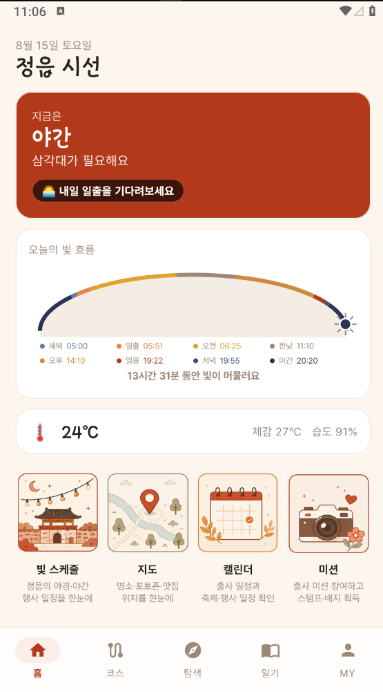
  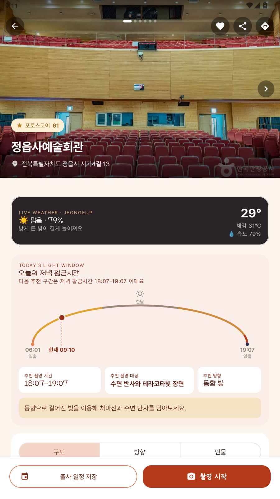
  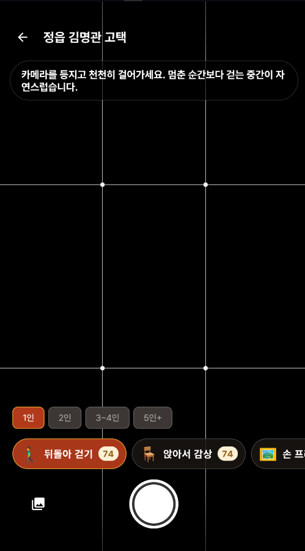
</p>

---

## 왜 만들었나

관광 앱은 많습니다. 대부분 **"어디를 갈까"** 까지 답하고 끝납니다.

그런데 사진을 찍으러 가는 사람에게는 그것으로 부족합니다. 같은 내장산이라도
한낮에 가면 빛이 강해 평범한 사진이 나오고, 일몰 30분 전에 가면 단풍이
역광으로 투명하게 빛납니다. **어디를 갈지보다 언제 갈지가 사진을 결정합니다.**

정읍 시선은 **"지금 어디를, 언제, 어떻게 담을까"** 까지 답합니다.

### 왜 정읍인가

정읍은 내장산 단풍철에 관광객이 몰리고 나머지 계절에는 비는 곳입니다.
그런데 출사의 관점으로 보면 정읍에는 사계절이 다 있습니다 — 봄 벚꽃,
여름 계곡, 가을 단풍과 구절초, 겨울 설경. 문제는 **"지금 뭐가 볼 만한지"를
알 방법이 없다는 것**입니다.

그래서 이 앱은 축제 일정이 아니라 **피사체의 절정 시기**를 기준으로 만들었습니다.
(관광공사 API 에 등록된 정읍 축제가 2026년 기준 0건인 현실적 이유도 있습니다)

---

## 핵심 아이디어 — 빛을 계산한다

이 앱의 모든 기능은 **하나의 계산**에서 나옵니다.

```
한국천문연구원 일출·일몰       ─┐
기상청 초단기실황 (기온·습도·풍속) ─┼─→  지금의 빛 구간(LightPhase)  ─→  모든 화면
기상청 단기예보 (시간대별 기온·하늘) ─┤      (새벽·일출·오전·한낮·오후·일몰·저녁·야간)
촬영지의 방위·최적 시간대        ─┘
```

이 값 하나가 홈의 인사말, 촬영지 점수, 코스 배치, 포즈 추천을 전부 바꿉니다.
**같은 장소가 시간에 따라 다른 점수를 받고, 같은 포즈가 시간에 따라 순위가
바뀝니다.**

> 전부 결정론적 계산입니다. LLM 은 여기서 나온 결과를 설명하는 문장만 씁니다.
> 그래서 네트워크가 끊기거나 LLM 이 실패해도 추천 자체는 항상 나옵니다.

---

## 화면별 기능

### 0. 스플래시 — 켜는 순간부터 움직인다

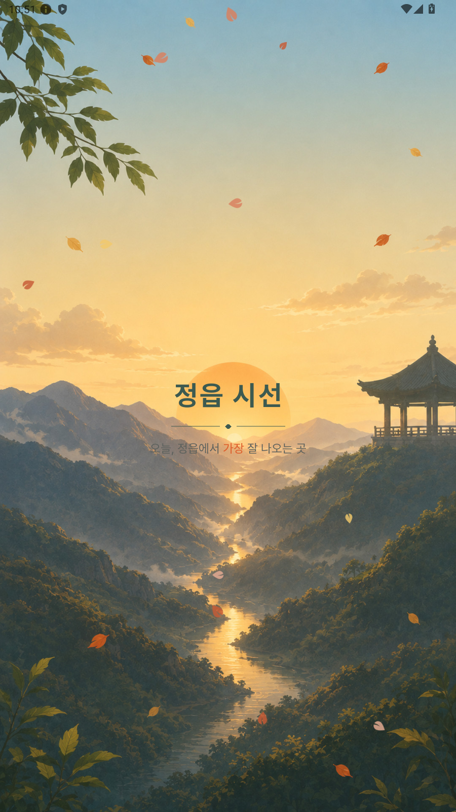

정읍의 산과 강 위로 해가 뜨는 그림이 화면을 채우고, 그 위에 **정읍 시선** ·
가는 구분선 · `오늘, 정읍에서 가장 잘 나오는 곳`이 차례로 떠오릅니다.
그림은 천천히 당겨지고(켄 번즈), 단풍잎이 떨어집니다. 가만히 박힌 로고
한 장이 아니라 앱이 무엇을 하는 앱인지 첫 3초가 말하게 했습니다.
라이브러리는 쓰지 않았고 안드로이드 기본 애니메이션 API 와 Canvas 로
그렸습니다 — 단풍잎은 잎마다 속도·흔들림·회전이 다른 커스텀 뷰입니다.

Android 12+ 는 런처에서 켠 앱 앞에 OS 가 **단색 시작 창**을 강제로
그립니다(앱이 없앨 수 없고 색만 정할 수 있습니다). 그래서 시작 창 색을
스플래시 첫 프레임과 같은 노을색으로 두고, 첫 프레임에서 그 색의 막이
걷히며 그림이 드러나게 해 단색과 움직임이 끊기지 않게 했습니다.
단색이 머무는 시간은 곧 콜드 스타트 시간이라, 지도 SDK 초기화처럼
스플래시에 필요 없는 일은 앱 시작에서 빼서 처음 쓰는 화면으로 미뤘습니다.
스플래시 전용 액티비티가 애니메이션을 끝까지 보여 준 뒤 온보딩 또는
홈으로 넘깁니다.

<br clear="right" />

### 1. 홈 — 지금 나가야 하나


앱을 여는 이유는 하나입니다. **지금 나가야 하는지 아닌지.**
그래서 첫 화면이 그 답부터 합니다.

**① 빛 보고서 (히어로)**

인사말이 아니라 관측 보고서입니다.

- `● 지금 12:58 · 일몰까지 6시간 22분` — 구간 이름만으로는 그 구간이 막
  시작됐는지 끝나가는지 알 수 없습니다. 가장 가까운 태양 사건까지의
  거리가 그 자리를 메웁니다
- **지금은 한낮이에요.** — 구간 이름만 색을 올립니다. 문장 전체가 한 색이면
  눈이 왼쪽부터 읽어 내려가야 답을 만나는데, 궁금한 낱말은 하나뿐입니다
- **다음 출사 적기** — `오늘 18:51, 붉은 빛이 내려앉기 시작해요` +
  `⏱ 다음 촬영 적기까지 5시간 52분`. 해가 진 뒤에는 **내일 새벽**으로
  넘어갑니다. 밤에 앱을 여는 사람이 알고 싶은 건 오늘이 끝났다는 사실이
  아니라 내일 몇 시에 나가야 하는가 입니다
- 오른쪽 위에 **하늘 상태**(`☁ 흐림`). 맑음·흐림은 취향이 아니라 조건입니다.
  맑으면 한낮 하늘이 하얗게 날아가고, 흐리면 온 하늘이 소프트박스가 됩니다

> **카드 바탕색이 지금의 빛을 따라갑니다.** 한낮은 회갈, 오후는 황토,
> 일몰은 붉은색, 야간은 남색. 붉은 카드가 "야간"이라고 말하고 있으면
> 글자와 색이 서로 다른 말을 합니다. 빛을 다루는 앱이라 색 자체가 정보입니다.

**② 오늘의 빛 흐름**

하루 24시간을 호로 눕히고 그 아래에 정읍의 지형을 깔았습니다.
왼쪽은 해가 뜨는 붉은 흙과 떠오르는 해, 가운데는 들과 나무, 오른쪽은
해가 지는 쪽의 푸른 산·물·달·별입니다.

땅은 장식이 아니라 방향입니다. 호의 색이 주황에서 남색으로 넘어가는 것과
땅이 같은 방향을 가리켜서, 그림 어느 쪽을 봐도 하루가 어디로 흐르는지
읽힙니다.

- 여덟 구간이 각자의 색으로 호에 들어갑니다. 골든아워·블루아워는 20~30분
  짜리라 아주 얇은 띠로 나오는데, **그 얇음 자체가 "놓치면 끝"** 을
  말해 주므로 억지로 넓히지 않았습니다
- 아래 4열 2행 격자에 구간 이름과 시각. 지금 구간에는 알약이 깔립니다
- `13시간 29분 동안 빛이 머물러요`

**③ 현재 기온**

`오늘의 기온`이 아니라 **`현재 기온`** 입니다. 초단기실황은 한 시점의
관측값이라 하루 전체를 말하는 이름이 맞지 않습니다.

- 기온 · 체감온도 · 습도를 같은 무게로. 기온만 크게 두면 "지금 나가도
  되나"를 실제로 가르는 것이 습도·바람이라는 점이 가려집니다
- **오늘의 기온 곡선** — 단기예보(`getVilageFcst`)의 시간대별 기온.
  실황은 지금 한 시점만 주므로 "몇 시에 나가면 좋나"에는 답하지 못합니다
- 한 줄 풀이 — `습도가 높아 실제보다 3℃ 더 덥게 느껴져요`.
  1℃ 차이는 말하지 않습니다. 반올림에서 생기는 값이라 근거가 약합니다

**④ 그 아래**

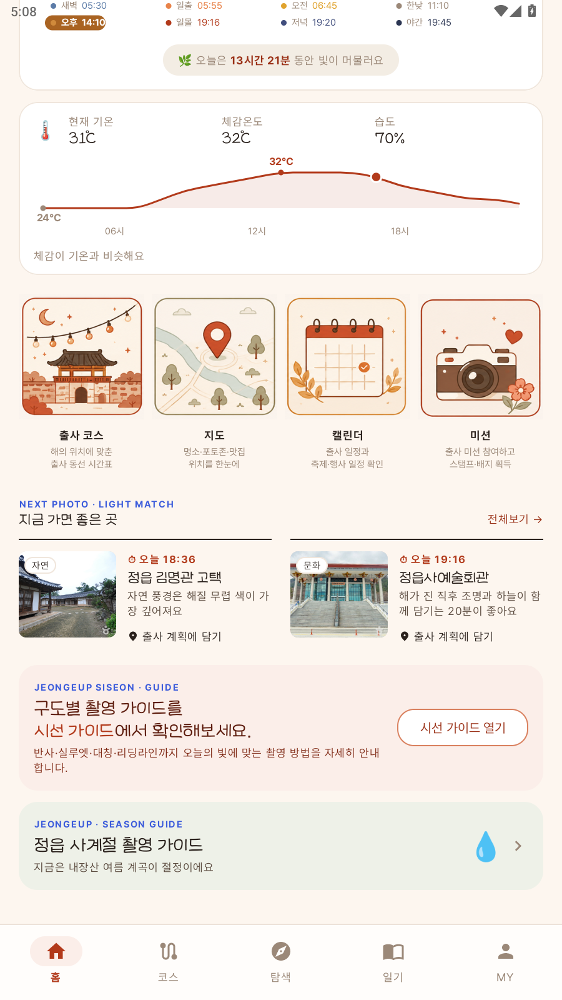

- **빠른 이동 타일 4개** — 출사 코스 · 지도 · 캘린더 · 미션
- **지금 가면 좋은 곳 (LIGHT MATCH)** — 시안대로 개편한 추천 목록입니다.
  카드의 첫 줄이 점수가 아니라 **시각**입니다 — `⏱ 오늘 18:39`,
  지나갔으면 `내일 06:54`로 넘겨 말합니다. 이 목록의 약속이
  "여기가 좋다"가 아니라 **"몇 시에 가면 빛이 맞는다"**이기 때문입니다.
  주제 칩은 사진 위로 올리고, 그 시간의 빛이 무엇을 만드는지 한 줄
  (`자연 풍경은 해질 무렵 색이 가장 깊어져요`)을 달았습니다.
  카드의 **출사 계획에 담기**를 누르면 상세에 들어가지 않고도 한 곳짜리
  출사 일정으로 바로 저장됩니다
- **시선 가이드 배너** — 사진 목록이 "어디를"에 답했으니 바로 아래에서
  "어떻게"로 잇습니다. **시선 가이드 열기**를 누르면 맨 위 추천 장소의
  이름·빛 상태·추천 구도를 들고 시선 가이드로 넘어갑니다

<br clear="right" />

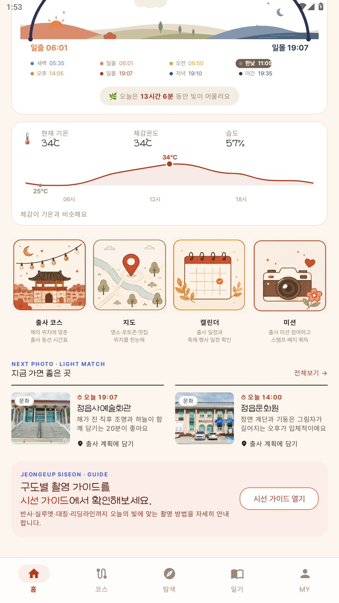

**체감온도는 기상청 식을 그대로 옮겼습니다.**

여름과 겨울이 서로 다른 식을 씁니다. 여름은 습도가, 겨울은 바람이
지배하기 때문입니다. 어느 식을 쓸지는 기온이 아니라 **월**로 가릅니다 —
24℃라도 습도 90%면 땀이 안 마르는데 "25℃ 이상"으로 자르면 그런 날
체감이 기온과 같게 나와 정보가 사라집니다.

필요한 값(기온·습도·풍속)이 모두 초단기실황 **한 번의 응답**에 함께
들어 있어(T1H·REH·WSD) 추가 호출이 없습니다.

<br clear="right" />

### 2. 포토스코어 — 왜 이 점수인지 보여준다

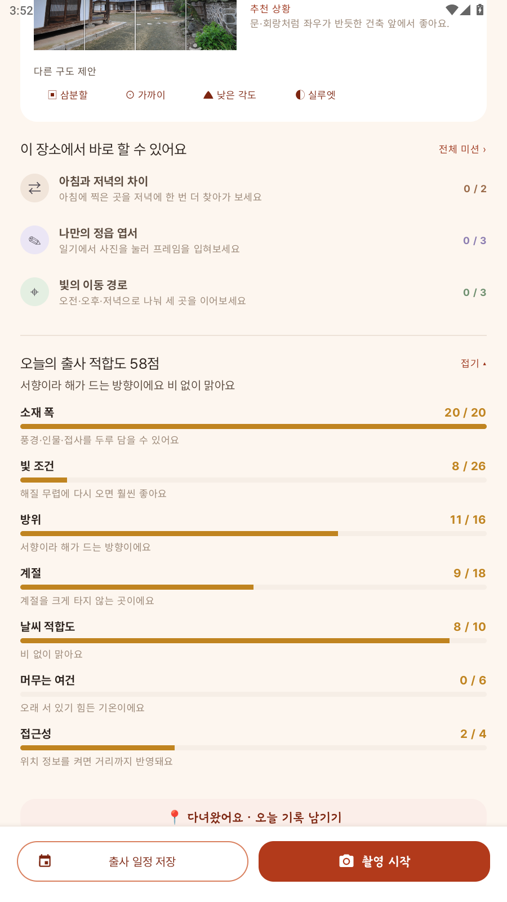

추천 점수는 **근거가 보여야 신뢰**가 생깁니다. 항목별로 펼쳐 보여 줍니다.

| 항목 | 배점 | 무엇을 보는가 |
|---|---|---|
| 빛 구간 적합 | 6~26 | 지금 빛이 **이 장소의** 최적 시간대와 맞는가 |
| 방위 적합 | 0~16 | 해가 있는 쪽과 장소가 바라보는 쪽 (역광·실루엣) |
| 계절 적합 | 0~18 | 단풍·구절초 같은 피사체가 지금 절정인가 |
| 날씨 | -18~+10 | 비·흐림. 실내는 비가 오히려 유리 |
| 소재 폭 | 12~20 | 풍경·인물·접사 중 몇 가지가 되는가 |
| 머무는 여건 | 0~6 | 빛을 기다릴 수 있는 기온인가 |
| 접근성 | 1~4 | 사진 품질이 아니라 실행 가능성 |

> **설계 기록.** 초기 버전은 100점 중 사진과 직결된 항목이 빛 20점뿐이었고,
> 나머지는 *관광공사 정보 갱신일*(10점), *API 에 대표 사진이 있는지*(4점) 같은
> 데이터 품질 지표였습니다. 그래서 점수 근거로 "정보가 최근에 갱신됐어요"가
> 나왔습니다. 사진이 잘 나오는지와 무관한 문장입니다.
> 앱이 이미 갖고 있던 촬영 특성(방위·최적 시간대)과 계절 절정기를 점수의
> 중심으로 옮겼습니다.

<br clear="right" />

### 3. 출사 코스 — 골든아워를 먼저 예약한다

<p>
  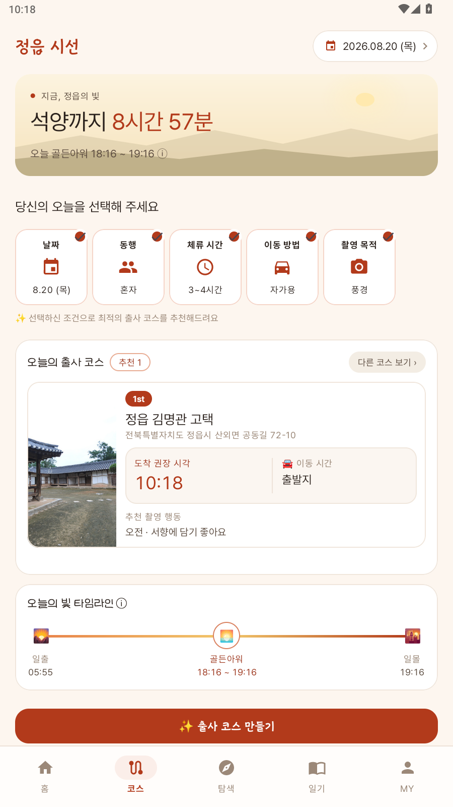
  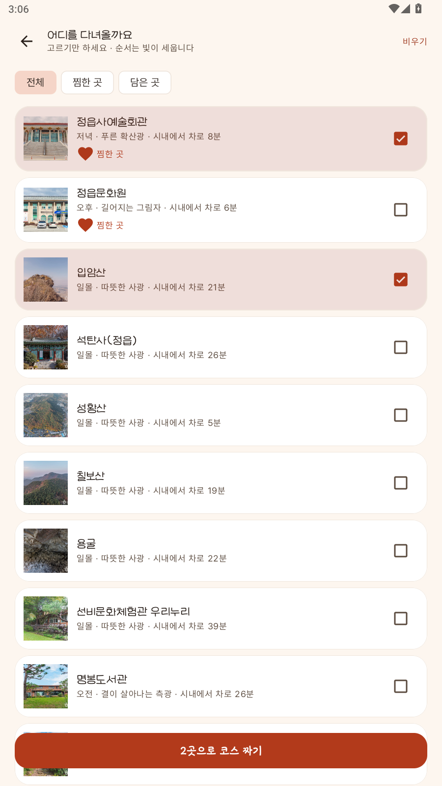
  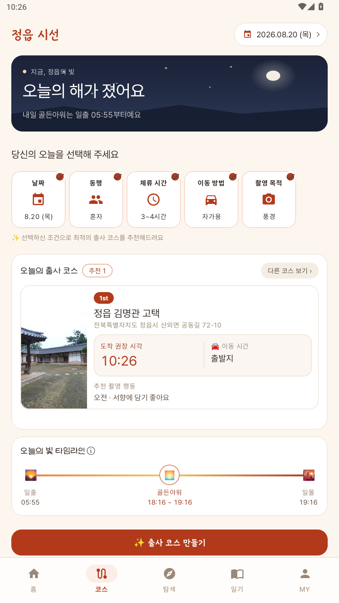
</p>

일반 여행 코스는 "영업시간 안에 몇 군데를 넣을까"의 문제입니다.
출사 코스는 **"빛을 언제 어디서 받을까"** 의 문제라 순서가 반대입니다.

1. **골든아워 슬롯을 먼저 예약** — 하루에 두 번뿐이고 30분씩밖에 없습니다
2. 그 슬롯에 **방위가 맞는 곳**을 꽂습니다 (일출↔동향, 일몰↔서향)
3. **한낮에는 실내**를 넣어 강한 빛을 피합니다
4. 남은 시간을 포토스코어·이동거리로 채웁니다

화면은 시안(빛 코스)을 따릅니다.

- **지금, 정읍의 빛 히어로** — "석양까지 58분"과 오늘 골든아워를 크게.
  배경 그림이 빛 구간(일출·낮·석양·블루아워·밤)을 따라 바뀝니다
- **내가 저장한 코스가 먼저** — 저장한 코스가 있으면 히어로 바로 아래에
  나옵니다. 코스를 세워 둔 사람이 이 탭을 여는 이유는 새 계획이 아니라
  그 계획이라서입니다. **오늘 예정 코스는 "오늘의 출사 계획" 카드**로
  따로 강조되고, 이어보기를 누르면 저장한 타임라인이 그대로 열립니다.
  저장할 때 출사 예정일을 함께 남겨 "오늘 것"을 가려냅니다
- **조건 카드 여섯 칸** — 날짜 · 동행 · **출발 시각** · 체류 시간 ·
  이동 방법 · 촬영 목적. 날짜를 바꾸면 그날의 일출·일몰을 천문 API 로
  다시 받아옵니다 (정읍 일몰은 8월 19:26, 12월 17:21 로 두 시간 넘게
  차이 납니다). 동행(혼자·커플·가족·친구)은 체류 시간 배수로 반영됩니다.

  > 출발 시각은 원래 고를 수 없었습니다 — 오늘이면 "지금부터", 다른 날이면
  > 오전 9시로 고정이었죠. 그래서 저녁에 앱을 열면 코스 세 칸이 전부
  > 야간으로 채워졌고, **내일 새벽에 나가려는 사람은 그 코스를 오늘 밤에
  > 짤 수 없었습니다.** 지역을 넓히면 하루짜리 코스가 아니게 되므로
  > "몇 시에 시작하느냐"는 날짜만큼 큰 조건입니다
- **직접 고르기 — "장소는 내가, 순서는 빛이"** — 코스를 앱이 전부 짜
  주기만 하면 "나는 여기랑 여기만 갈래"가 안 되고, 찜을 해 둬도 그 찜한
  곳으로 코스를 만들 수가 없습니다. 그렇다고 순서까지 손으로 짜게 하면
  이 앱의 전제가 무너집니다 — 골든아워는 하루에 두 번, 30분씩뿐이라
  그 자리를 사람이 정하면 빛을 계산하는 뜻이 사라집니다.

  그래서 **고르는 일만** 돌려줍니다. 전체 · 찜한 곳 · 담은 곳으로 걸러
  보며 담고, 순서는 그대로 [CoursePlanner] 가 빛으로 세웁니다. 아무것도
  안 담으면 지금까지처럼 전체에서 짜므로, 이 화면을 몰라도 앱은 그대로
  돌아갑니다.

  > 담은 곳이 다 들어가지는 않습니다. 시간 안에 들어가는 곳만 세우기
  > 때문입니다. 세 곳을 담았는데 두 곳만 나오면 말해 주지 않는 한
  > 버그로 보이므로, 결과 화면이 **"담은 3곳 중 2곳이 들어갔어요 ·
  > 정읍사예술회관 · 저녁 블루아워에 좋은 곳"** 처럼 빠진 곳과 그 곳이
  > 기다리는 빛을 함께 밝히고, 출발 시각이나 체류 시간을 바꾸면 들어갈
  > 수 있다고 덧붙입니다.

- **오늘의 출사 코스 미리보기** — 조건을 바꾸는 즉시 다시 계산됩니다.
  카드의 첫 정보가 이름이 아니라 **도착 권장 시각**입니다 — 이 화면의
  약속이 "어디"가 아니라 "몇 시에 가면 빛이 맞는가"라서입니다
- **오늘의 빛 타임라인** — 일출 · 골든아워 · 일몰이 한 줄로 붙습니다

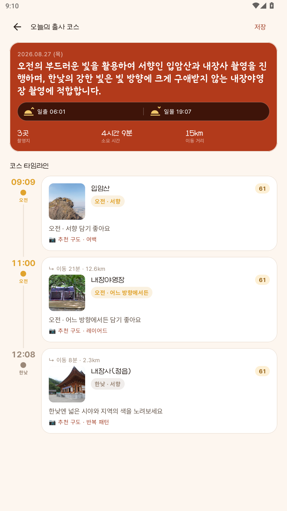

**결과는 빛의 타임라인입니다 (시안).**

머리에 **요약 카드 세 층** — 날짜(언제) → 한 줄 설명(왜 이 순서) →
숫자 세 칸(몇 곳 · 얼마 · 얼마나 멀리). 예전에는 이 셋이 단풍색 한
덩어리 안에 같은 무게로 쌓여 무엇이 제목이고 무엇이 수치인지 읽히지
않았고, 날짜가 어디에도 없어 "언제의 코스인지"를 모른 채 보게 됐습니다.
일출·일몰은 이모지(🌅) 대신 선 아이콘을 달고 좌우 두 칸으로 나눕니다 —
이모지는 기기마다 그림이 달라 같은 화면에서도 톤이 튑니다.

왼쪽 축이 시각 + 빛 구간(오후 · 일몰 · 야간)을 색 점과 함께 말하고,
오른쪽 카드에 관광공사 실사진 · 빛 배지(`일몰 골든아워 · 서향`) ·
이동 정보 · 추천 구도가 붙습니다. 축만 훑어도 하루의 빛이 어디로
흐르는지 보이고, 카드를 누르면 그 장소의 상세로 갑니다.

**타임라인이 스스로 날짜를 말합니다.** 맨 앞에 `8월 27일 (목)` 줄이
서고, **날이 바뀌는 자리마다** 줄이 한 번 더 섭니다. 시각(13:51 ·
15:42)만 있으면 그것이 어느 날의 13시인지 알 수 없습니다. 지금은
하루짜리 코스뿐이라 헷갈릴 일이 적지만, 지역을 넓히면 1박 2일 코스가
나오고 그때는 "둘째 날 06시"와 "첫날 06시"가 같은 줄로 보이게 됩니다.

날짜가 바뀌는 지점은 **도착 시각이 앞 정거장보다 이른 곳**으로 찾습니다.
코스는 `LocalTime` 만 들고 있어 날짜가 없지만, 하루 안에서는 시각이
언제나 커지므로 23:00 다음의 01:00 은 자정을 지난 것이 확실합니다.

**날짜·출발 시각은 여기서 바로 고칩니다.** 머리의 날짜 알약
(`2026.08.27 (목) · 13:51 출발 ›`)을 누르면 날짜 → 시각 순으로 묻고
그 자리에서 다시 짭니다. 결과를 보고 나서야 "한 시간 늦게 나갈걸",
"이건 내일 하자"가 생기는데, 그때마다 입력 화면으로 되돌아가
동행 · 체류 · 이동 · 목적을 다시 고르게 하면 아무도 고치지 않습니다.
나머지 조건은 그대로 두고 둘만 바꾸며, **고른 날짜의 일출·일몰을 천문
API 로 새로 받아옵니다** — 오늘 값을 그대로 쓰면 몇 주 뒤 코스의
골든아워 슬롯이 통째로 어긋납니다(8월 27일은 06:01–19:07,
9월 11일은 06:12–18:46).

> 저장한 코스에서는 알약이 눌리지 않습니다. 조건(촬영지 풀 · 동행 ·
> 체류)이 남아 있지 않아 다시 짤 수 없기 때문입니다. 눌리는데 아무 일도
> 일어나지 않는 것이 가장 나쁘므로, 그때는 알약을 걷고 평범한 글줄로
> 되돌립니다.

> **추천 구도가 세 칸 내내 같던 문제.** 구도를 카메라 오버레이의 세
> 종류(삼분할 · 대칭 · 중앙)에서만 골랐고, 장소의 촬영 특성은
> `contentTypeId` 하나로 추정했습니다. 그래서 정읍사예술회관 ·
> 정읍시립미술관 · 정읍문화원이 "전부 문화시설(14)"이라는 이유로 방위 ·
> 시간 · 구도가 똑같아졌고, 코스 세 칸에 `추천 구도 · 좌우 대칭축`이
> 세 번 나왔습니다. 두 곳을 고쳤습니다 — ① 장소 이름의 **끝머리**를
> 2차 판별로 넣어(미술관은 실내 전시, 회관은 정면 계단, 저수지는 물,
> 능선은 하늘) 같은 분류 안에서도 갈리게 하고, ② 구도를 **시선 가이드의
> 열 구도**에서 고르되 장소의 촬영 특성 한 줄 → 도착 시각의 빛 →
> 오버레이 구도 순으로 판정하게 했습니다.

> **"삼각대가 필요해요" 문제.** 그 장소의 최적 시간이 아닐 때 빛 구간의
> `hint` 를 그대로 썼는데, 그것은 "삼각대가 필요해요"처럼 **장비 조건**이라
> 코스 세 칸이 나란히 같은 문장으로 채워지면 왜 여기를 가는지가 사라집니다.
> 대신 그 빛에 **무엇이 찍히는지**를 말하게 했습니다 —
> `한낮엔 넓은 시야와 지역의 색을 노려보세요`.

<br clear="right" />

### 4. 촬영지 탐색 — 빛이 맞는 출사

<p>
  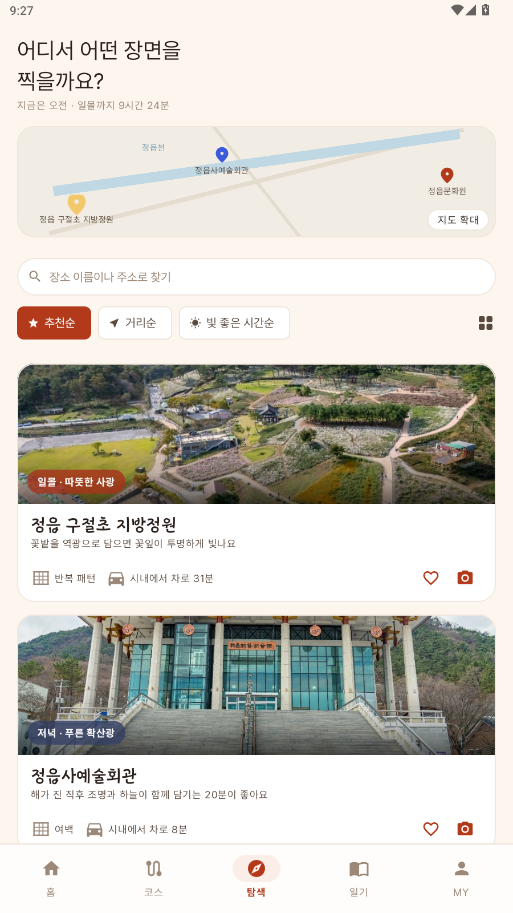
  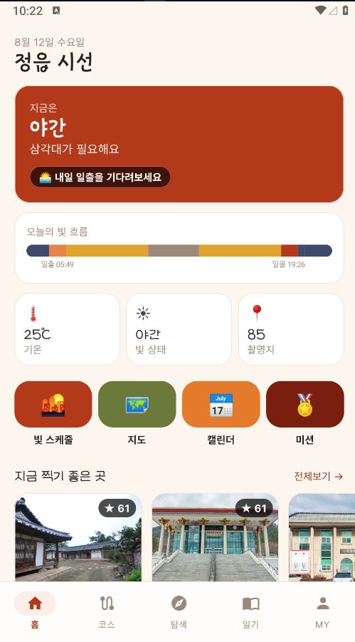
  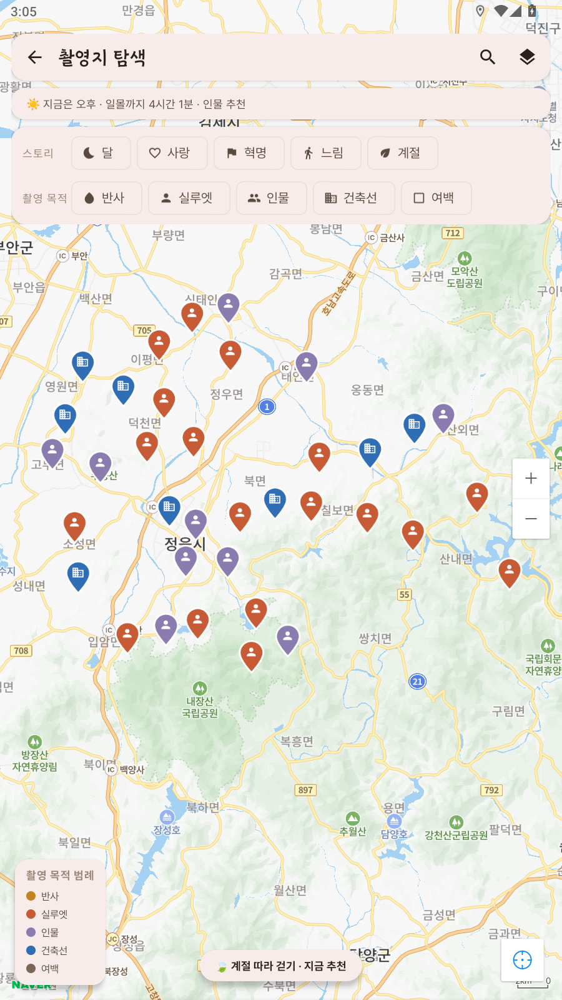
  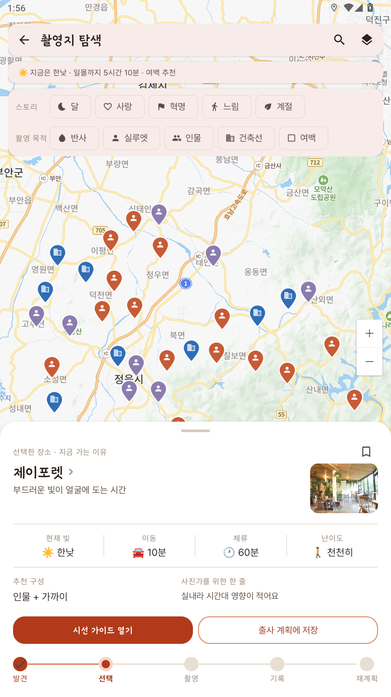
</p>

탐색을 시안(LIGHT MATCH)대로 개편했습니다. 화면의 첫 물음이
"무엇을 볼까"가 아니라 **"어떤 순서로 볼까"**입니다.

- **약도 미리보기** — 실제 지도를 살아 있는 채로 넣으면 목록 스크롤과
  지도 스크롤이 싸웁니다. 정읍천 물길과 핀만 그린 약도를 두고,
  누르면 진짜 지도로 넘어갑니다
- **정렬 셋** — 추천순(포토스코어) · 거리순(시내 기준 이동 시간) ·
  **빛 좋은 시간순**(그 장소의 빛이 맞는 다음 시각이 가까운 순).
  세 번째가 이 앱의 정렬입니다 — 지금 16시라면 일몰 스팟이 맨 위로
  올라옵니다. 카테고리 필터는 오른쪽 버튼 뒤로 옮겼습니다
- **검색** — 정렬 줄 위에 `장소 이름이나 주소로 찾기` 칸. 글자를 칠 때마다
  바로 걸러지고 띄어쓰기·대소문자는 무시합니다(`내장 산`도 내장산을 찾습니다).
  카테고리와 겹쳐 걸리고, 검색어는 탭을 오가도 남습니다. 결과가 없으면
  `‘xxx’에 맞는 촬영지가 없어요`라고 검색어 탓임을 밝힙니다 — 카테고리가
  비었다는 문구를 그대로 쓰면 엉뚱한 데서 원인을 찾게 됩니다. 접히는
  머리말이 아니라 고정 줄에 둔 것은, 목록을 내리다 검색어를 고치려는데
  칸이 사라져 있으면 맨 위로 다시 올려야 하기 때문입니다. 지도 화면의
  돋보기를 누르면 이 칸이 열린 채로 넘어옵니다
- **카드** — 위계를 세 단으로 잡았습니다. 사진 **위**에 빛 신호 뱃지
  (`일몰 · 따뜻한 사광`, 바탕은 그 빛 구간의 색) → 아래에 장소명(크게)과
  이유(작게) → 맨 아래 한 줄에 구도·거리를 아이콘으로 눕히고 오른쪽 끝에
  찜(♡)과 시선 가이드(📷). 카드 폭의 1/3을 먹던 CTA 버튼을 없애고
  카드 전체를 탭 영역으로 넓혔습니다
- **약도 ↔ 목록 연동** — 약도의 핀 셋은 그린 그림이 아니라 **지금 목록의
  맨 위 세 곳**입니다. 정렬·필터를 바꾸면 이름이 함께 바뀌고, 목록을
  스크롤하면 맨 위에 온 카드의 핀이 커집니다
- **정렬 칩의 아이콘** — 선택 상태를 색으로만 표시하면 색을 구분하기
  어려운 화면·눈에서 사라집니다. ★ · 방향 · 해 아이콘을 함께 답니다
- **촬영지 탐색 지도 (시안)** — 마커의 축이 관광 분류가 아니라
  **촬영 목적**(반사 · 실루엣 · 인물 · 건축선 · 여백)입니다. 위 칩으로
  스토리(달 · 사랑 · 혁명 · 느림 · 계절)와 목적을 거르고, 스토리로 몇 곳이
  남으면 점선 걷기 동선이 이어집니다.
  **스토리를 고르면 지도의 축이 바뀝니다** — 마커가 그 이야기의 색과
  아이콘(달=달빛 네이비 🌙, 사랑=연분홍 🤍, 혁명=적갈 🚩, 느림=흙빛 🐌,
  계절=상록 🍃)으로 갈아입고, 범례도 스토리 범례로 바뀌며, 걷기 동선까지
  같은 색으로 이어집니다. 상단에 `🐌 지금 느림 코스 39곳` 배지가 떠
  칩을 누른 결과가 즉시 되돌아옵니다. 색과 아이콘 두 겹으로 코딩한 것은
  밝은 야외 화면이나 색각 이상에서 색 하나만으로는 구분이 사라지기
  때문입니다. 마커를 고르면 아래 시트가
  **왜 지금 가는지**(현재 빛 · 이동 · 체류 · 난이도 · 추천 구성 · 사진가를
  위한 한 줄)부터 답하고, 발견 → 선택 → 촬영 → 기록 → 재계획 단계가
  아래에 붙습니다. 상태줄은 "지금은 석양 · 일몰까지 58분 · 반사 추천"처럼
  지금의 빛을 먼저 말합니다

### 5. 촬영지 상세 — 언제·어디서·어떻게

<p>
  
  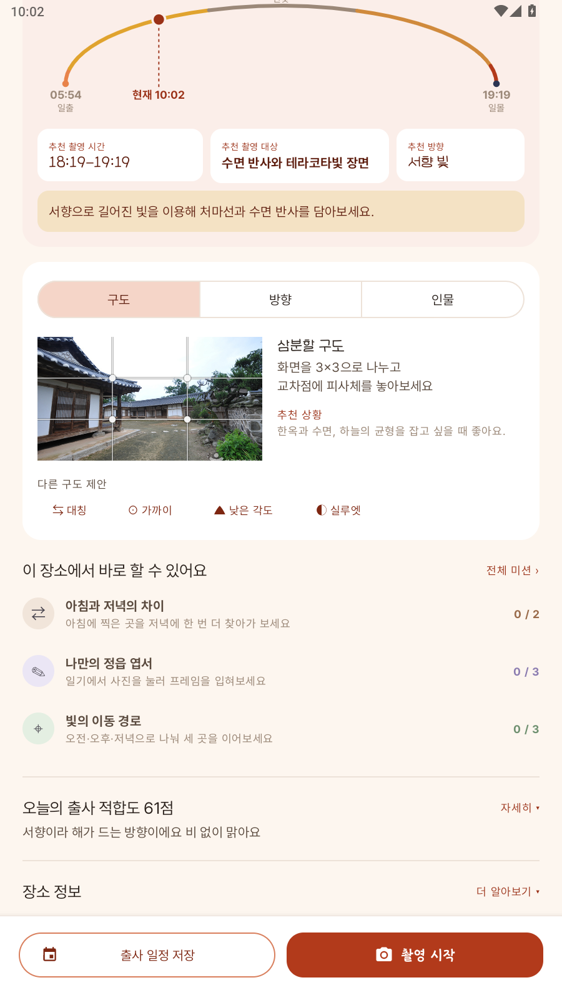
  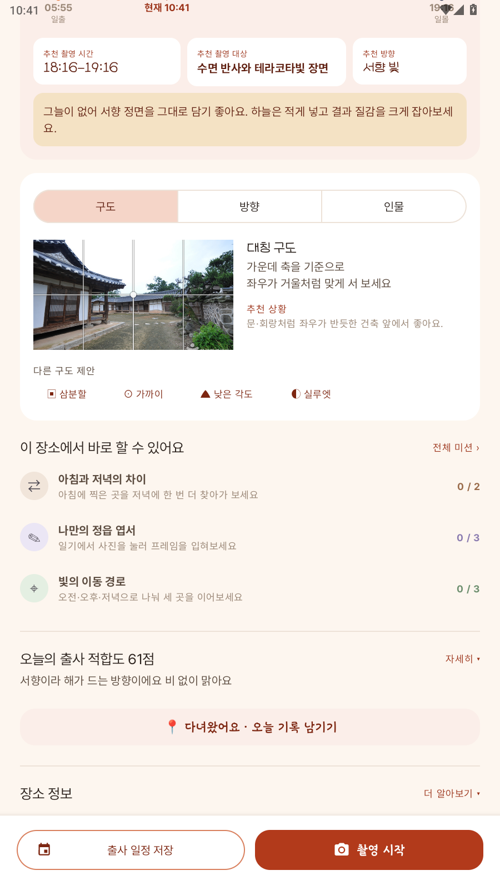
</p>

상세 화면을 시안 기준으로 전면 개편했습니다. 설계 원칙은 하나입니다 —
**화면의 순서가 곧 질문의 순서**여야 한다는 것. 상세 화면에서 사용자가
차례로 묻는 질문은 "여기가 어디지" → "지금 가도 되나" → "몇 시에 가야 하나"
→ "가서 어떻게 찍나"이고, 카드가 그 순서대로 배치됩니다.

**① 히어로 — 사진 위에 이름을 얹는다**

- 장소명 · 주소 · 포토스코어를 **사진 위에** 얹습니다. 사진 아래 흰 여백에
  두면 첫 화면에서 사진과 이름이 분리돼 "이 사진이 그 장소"라는 연결을
  눈이 다시 만들어야 합니다. 아래 스크림을 깔아 어떤 사진에서도 읽힙니다
- 사진 장수를 알려 주는 **페이지 점은 사진 맨 아래**, 주소 줄 밑에 둡니다.
  처음에는 위쪽 가운데였는데 시계·배터리 옆에 떠서 사진과 상관없는
  장식으로 읽혔습니다. 글 묶음의 아래 여백 안에 앉혀 글과 겹치지 않습니다
- 다녀온 곳 목록에서 들어오면 방문 기록에는 이름과 사진뿐이라 주소 줄이
  비어 있었습니다. 홈 목록에 같은 곳이 있으면 그 정보를 그대로 쓰고,
  없으면 개요를 받아올 때 같은 응답의 주소·좌표로 빈 칸을 채웁니다.
  좌표를 끝내 못 채우면 길찾기는 이름으로 검색한 지도를 대신 엽니다
- 오른쪽 위에 **찜 · 공유 · 길찾기** 동그라미 버튼 셋.
  - **찜** — 하트를 누르면 단말(SharedPreferences)에 저장됩니다. 로그인이
    없는 앱이라 계정 동기화 대신 "내 폰에 남는 목록"으로 설계했습니다
  - **공유** — 장소명 · 주소 · 오늘의 추천 시간이 텍스트로 나갑니다.
    "여기 가자"라는 말에는 **몇 시에 가자**가 함께 실려야 출사 약속이 됩니다
  - **길찾기** — 원래 하단 버튼이었는데 히어로로 올렸습니다. 하단은
    "찍는 일"의 자리이고, 길찾기는 장소를 정하기 전의 일이라서입니다

**② 라이브 날씨 — 어두운 카드 하나**

- `LIVE WEATHER · JEONGEUP` 어두운 카드에 하늘 상태 · 큰 온도 · 체감 · 습도.
  아래 황금시간 카드가 밝은 살구색이라, 같은 톤이면 두 카드가 한 덩어리로
  뭉쳐 보여 일부러 어둡게 갈랐습니다
- 숫자(온도·체감·습도)는 **오른쪽 한 열**에 모읍니다. 체감이 왼쪽 문장에
  섞여 있으면 "지금 몇 도인가"를 두 번 읽게 됩니다
- 왼쪽 문장은 숫자가 못 하는 말을 합니다 — `온 하늘이 소프트박스가 됐어요`.
  출사에서 흐림은 나쁜 날이 아니라 **다른 날**이기 때문입니다

**③ 오늘의 황금시간 — 결론부터, 그래프는 근거로**

- `다음 추천 구간은 저녁 황금시간 18:19–19:19 이에요` 한 줄이 먼저 나오고,
  일출~일몰 호 위에 현재 시각 마커가 찍힙니다. 그래프를 해석해야 결론이
  나오는 화면은 현장에서 쓰이지 않습니다
- 아래 세 칸 — **추천 촬영 시간 · 추천 촬영 대상 · 추천 방향**.
  가운데 칸은 "이 시간에 무엇을 담게 되는가"(`수면 반사와 테라코타빛 장면`)
  입니다. 체감온도를 두던 자리였는데, 위 날씨 카드가 이미 말한 숫자를
  반복하는 대신 시간대별 피사체를 답하게 바꿨습니다
- 방향 칸은 `서향`이 아니라 **`서향 빛`** 입니다. "서향"은 지도의 말이고
  "서향 빛"이 사진의 말입니다. 실내·무관인 곳은 방향이 없으므로 그대로 둡니다

**④ 촬영 가이드 — 구도 · 방향 · 인물 탭**

<p>
  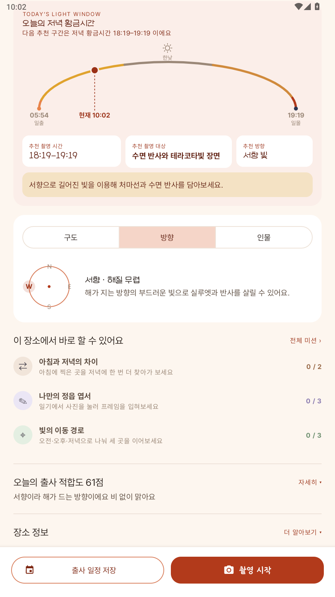
  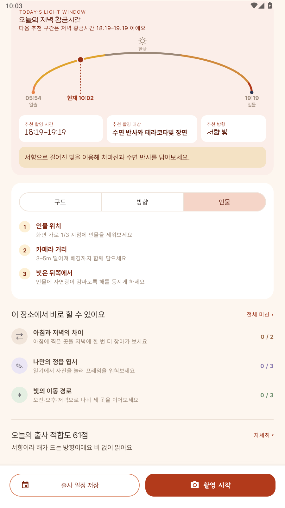
</p>

예전에는 구도·방향·빛이 알약 세 개로 요약만 됐습니다. 이름은 알려 주지만
현장에서 필요한 것은 **"그래서 어떻게 서고 어디를 보나"** 라서, 탭 하나가
질문 하나에 답하도록 폈습니다.

- **구도 탭** — 남의 장소 예시가 아니라 **이 장소의 실제 사진 위에**
  삼분할·대칭·중앙 가이드 선을 얹습니다. "여기서 이렇게"가 되려면 배경이
  여기여야 합니다. 어떤 구도를 보여줄지는 장소 유형과 날씨([WeatherAdviser])가
  정하고, "추천 상황" 한 줄과 다른 구도 제안 칩이 따라붙습니다
- **방향 탭** — "서향"이라는 글자만으로는 몸을 어디로 돌릴지 한 번 더
  생각해야 합니다. **나침반 그림**(커스텀 뷰 `FacingCompassView`)의 네 방위 중
  하나가 켜져 있으면 글자를 해석하는 단계가 사라집니다. 실내·무관인 장소는
  나침반을 빈 채로 두면 "고장난 그림"으로 읽히므로 그림 자체를 뺍니다
- **인물 탭** — 인물 위치(가로 1/3) · 카메라 거리(3–5m) · 빛은 뒤쪽에서.
  번호 셋으로 끝나는 체크리스트입니다. 사람을 세워 두고 읽는 글이라
  세 줄을 넘기지 않았습니다

**⑤ 그 아래**

- **이 장소에서 바로 할 수 있어요** — 이 장소에서 되고, 아직 안 끝났고,
  지금 빛에 맞는 미션 최대 셋 (미션 항목 참조). 진행도는 `0/3` 숫자와
  도트(●●○)를 겹쳐 씁니다 — 숫자는 좁은 칸에서 가장 먼저 잘리고("0 /"),
  도트는 잘려도 몇 개 남았는지가 보입니다
- **오늘의 출사 적합도** — **원형 게이지**로 보여 줍니다. `58점`이라는
  숫자만 있으면 높은지 낮은지 견줄 데가 없어 읽어도 판단이 서지 않습니다.
  절반쯤 찬 원은 글자를 읽기 전에 이미 "그저 그렇다"를 말합니다. 색도
  구간을 따릅니다(70↑ 초록 · 45↑ 골드 · 그 아래 단풍). 눌러 펴면 항목별
  근거가 그대로 나옵니다 (포토스코어 항목 참조)
- **장소 정보 (접이식)** — 접힌 자리에도 **태그와 두 문장 요약**이 남습니다.
  예전에는 접으면 "장소 정보"라는 제목만 남아 무엇이 들었는지 알 수 없었고,
  펴면 열 줄짜리 문단 벽이 나왔습니다. 지금은 `#공연장 #전시 #뮤지컬` 태그와
  요약 세 줄이 훑는 사람의 몫이고, 더 궁금한 사람만 펼쳐 전문을 읽습니다.
  요약은 새로 쓰지 않고 **원문의 앞 문장을 그대로** 씁니다 — 관광공사 개요는
  첫 문단이 그 장소가 무엇인지를 말하는 구조라 앞이 곧 요지이고, 무엇보다
  없는 말을 지어내지 않습니다. 전문 쪽의 다듬기(HTML 제거 · 문단 나누기 ·
  촬영 낱말 형광펜)와 오디오 가이드(TTS 낭독 · 속도 조절)는 그대로입니다
- **하단 고정 액션바** — 시안대로 **출사 일정 저장 · 촬영 시작** 한 쌍.
  화면 어디에 있든 다음 행동(계획하거나, 지금 찍거나)이 손 닿는 곳에 있습니다

<br clear="right" />

### 6. 포즈 가이드 — 그래서 어떻게 서지

<p>
  
  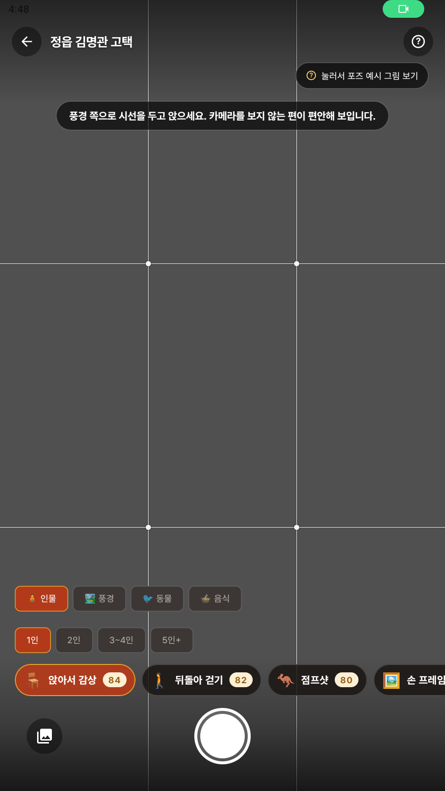
  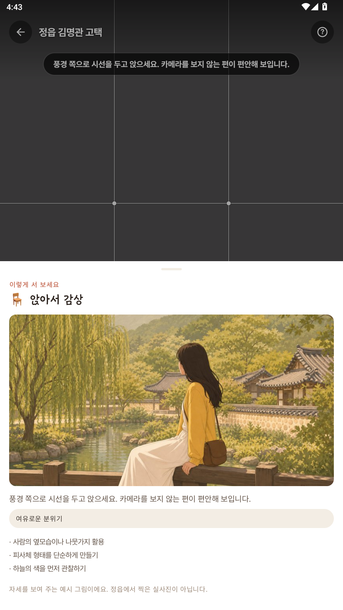
  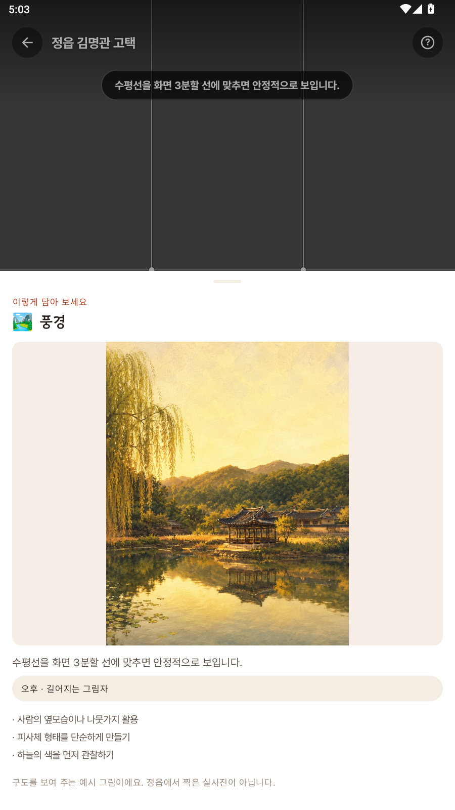
</p>
<p>
  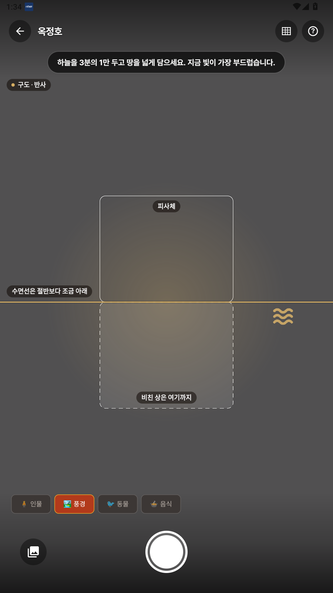
  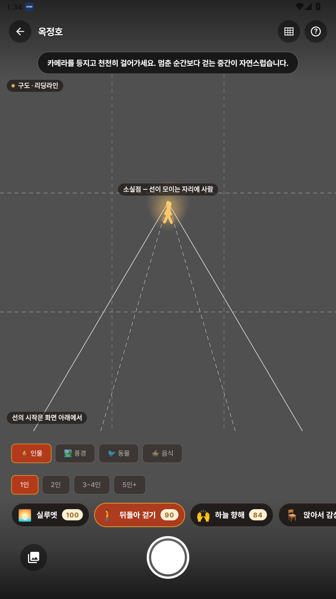
  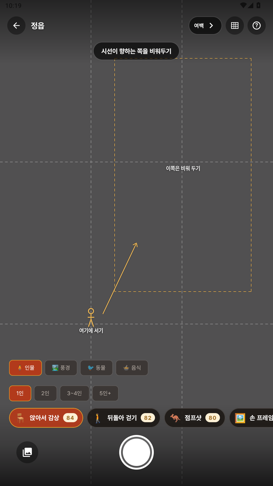
  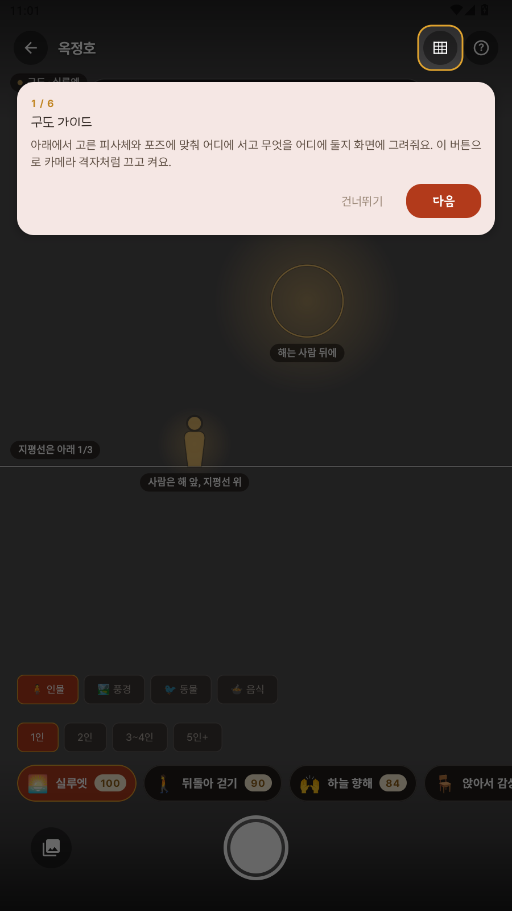
</p>

카메라를 켠 순간 실제로 막히는 지점은 구도가 아니라 **"그래서 어떻게 서지"** 입니다.

- **구도 가이드 (격자처럼 켜고 끄기)** — 격자만 긋지 않고 **어디에 서고
  무엇을 어디에 둘지**를 그립니다. 사람 표시, 수면선, 소실점, 비워 둘 자리,
  앞·중간·뒤 띠. 시선 가이드의 열 구도(대칭 · 실루엣 · 반사 · 리딩라인 ·
  프레임 인 프레임 · 탑뷰 · 여백 · 움직임 · 레이어드 · 반복 패턴)에
  삼분할 · 중앙을 더해 열둘입니다. 구도는 **아래에서 고른 것이 정합니다** —
  인물이면 포즈가(뒤돌아 걷기 → 리딩라인, 점프·하늘 향해 → 여백, 실루엣 →
  실루엣, 손 프레임 → 프레임 인 프레임), 풍경이면 장소와 지금 빛이(물가면
  반사, 능선이면 여백), 동물은 여백, 음식은 중앙. 위에서 구도를 따로
  고르게 하지 않습니다. "무엇을 찍나"를 골랐는데 "어떤 구도로"를 또
  고르라고 하면 같은 질문을 두 번 하는 셈입니다. 오른쪽 위 격자 버튼으로
  카메라 앱의 격자처럼 끄고 켜고, 마지막 상태를 기억합니다. 포즈 예시
  ("?")가 그림 한 장으로 보여 주던 것을 화면 위에 직접 얹은 셈입니다.
  그리는 법은 셋으로 고정했습니다 — 선은 가늘고 흰색(기준), 자리는 따뜻한
  색(여기)에 빛무리를 깔고, 글은 전부 어두운 알약 안에(맨 글자는 밝은
  하늘에서 사라집니다), 비울 자리는 점선 상자가 아니라 옅게 채운 영역으로
  (점선 상자는 "넣어라"로 읽힙니다). 사람 자리에는 **고른 포즈의 실루엣
  그림**이 놓입니다 — 걷기 · 앉기 · 두 팔 들기 · 점프 · 위에서 본 사람,
  그리고 해와 물결. 단색(#FFCD70) 투명 PNG 일곱 장으로, 뒤돌아 걷기를
  고르면 소실점에 걷는 사람이, 하늘 향해를 고르면 두 팔 든 사람이 섭니다.
  손 프레임은 틀 안에 그냥 사람입니다 — 틀이 곧 프레임이라 손 그림까지
  겹치면 두 번 말하는 셈입니다
- **첫 실행 버튼 안내** — 카메라를 처음 열면 홈과 같은 덮개로 격자 버튼 →
  포즈 예시 → 피사체 → 인원 → 포즈 목록 → 셔터 여섯 장을 짚어 줍니다.
  한 번 보면 다시 뜨지 않고, "앱 사용법 다시 보기"를 끝까지 보면 다시 켜집니다
- **포즈 6종** — 뒤돌아 걷기 · 점프샷 · 실루엣 · 앉아서 감상 · 하늘 향해 · 손 프레임
- **인원 선택** — 1인 / 2인 / 3~4인 / 5인+
- **포즈 예시 그림 (오른쪽 위 `?`)** — 이름과 한 줄 요령만으로는
  "뒤돌아 걷기"가 실제로 어떤 장면인지 안 떠오릅니다. 지금 고른 포즈의
  **자세 · 시선 · 카메라 자리**를 그린 그림 한 장을 띄웁니다.
  아래 포즈 칩 줄은 그대로 둡니다 — 무엇을 고를지는 거기서 정하고,
  고른 것이 어떤 자세인지는 이 버튼이 답합니다.
  **처음 들어왔을 때 한 번만** `눌러서 포즈 예시 그림 보기` 말풍선이
  버튼 아래에 뜹니다. `?` 는 아이콘만으로 그 뒤에 무엇이 있는지 알 수 없고,
  그렇다고 매번 띄우면 그때부터는 미리보기를 가리는 방해가 됩니다.
  6초 뒤 스스로 사라지고, 눌러도 사라지면서 바로 예시를 엽니다
- **피사체가 바뀌면 예시도 바뀝니다** — 인물이면 고른 포즈의 자세를,
  풍경 · 동물 · 음식이면 그 피사체를 담는 구도를 보여 줍니다.
  물음이 "어떻게 서지"에서 "어떻게 담지"로 바뀌므로 머리말도
  `이렇게 서 보세요` → `이렇게 담아 보세요` 로 갈립니다.
  그림은 앱이 그때 하는 말을 그대로 그린 것입니다 —
  풍경은 수평선이 아래 3분할선에 놓여 있고, 동물은 눈높이에서 찍혀
  시선 앞에 여백이 있고, 음식은 창가 역광에 김이 살아 있습니다
- **찍으면 카메라를 떠납니다** — 셔터를 누르면 사진이 갤러리에 저장되고
  그 자리가 방문 기록으로 남은 뒤, 카메라가 스스로 닫힙니다. 카메라에
  머물러 있으면 "한 장 더"가 계속 이어져 정작 찍은 것을 돌아볼 자리가
  없습니다. 남긴 사진은 **MY → 최근 촬영 아카이브**에서 봅니다
- **왼쪽 앨범 버튼은 보기 전용입니다** — 갤러리 앱이 아니라 **시스템 사진
  선택기**를 띄우고, 고른 사진은 시스템 사진 뷰어로 넘깁니다.
  포토 프레임은 **내가 남긴 기록**(MY 아카이브 · 일기)에서 꺼낼 때만
  씁니다 — 남이 다른 날 다른 곳에서 찍은 사진에 이 장소 이름을
  붙여 둘 이유가 없습니다

> **예시 그림만 유일하게 실사진이 아닙니다.** 앱의 장면 사진은 전부
> 관광공사 실사진인데, 포즈는 사정이 다릅니다. "무릎을 접으면 더 높아
> 보인다"를 보여 주려면 그 자세로 찍힌 사진이 필요한데, 관광공사 사진에
> 그런 컷은 없고 모르는 사람의 얼굴을 예시로 걸 일도 아닙니다.
> 그래서 이 여섯 장만 그림이고, 화면 아래에 **"정읍에서 찍은 실사진이
> 아닙니다"** 라고 밝혀 둡니다.

포즈 점수는 **고정값이 아닙니다.** 지금의 빛 · 장소 방위 · 인원으로 매번
다시 계산합니다.

> 고정값이면 한밤중에도 "실루엣"이 1등으로 뜹니다. 실루엣은 해를 등져야
> 성립하므로 그때는 후순위가 맞습니다. 실제로 **야간에는 뒤로 밀리고
> 일몰 골든아워에는 100점 1위로 올라옵니다.**

<br clear="right" />

### 7. 시선 가이드 — 구도를 배우고 그 자리에서 써 본다

<p>
  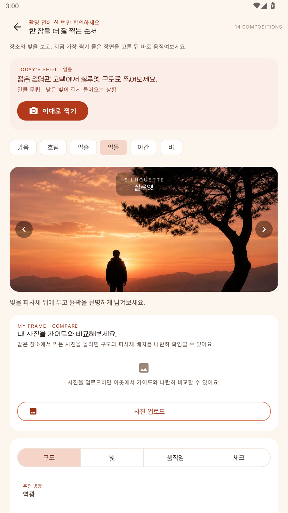
  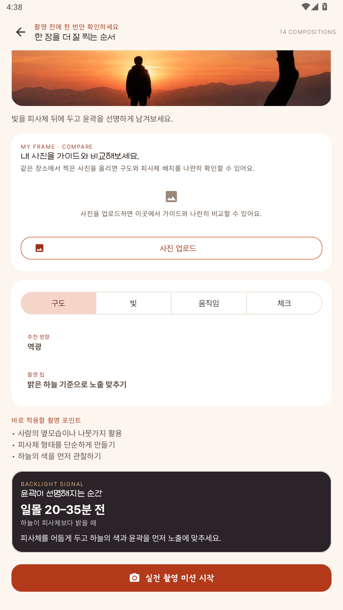
  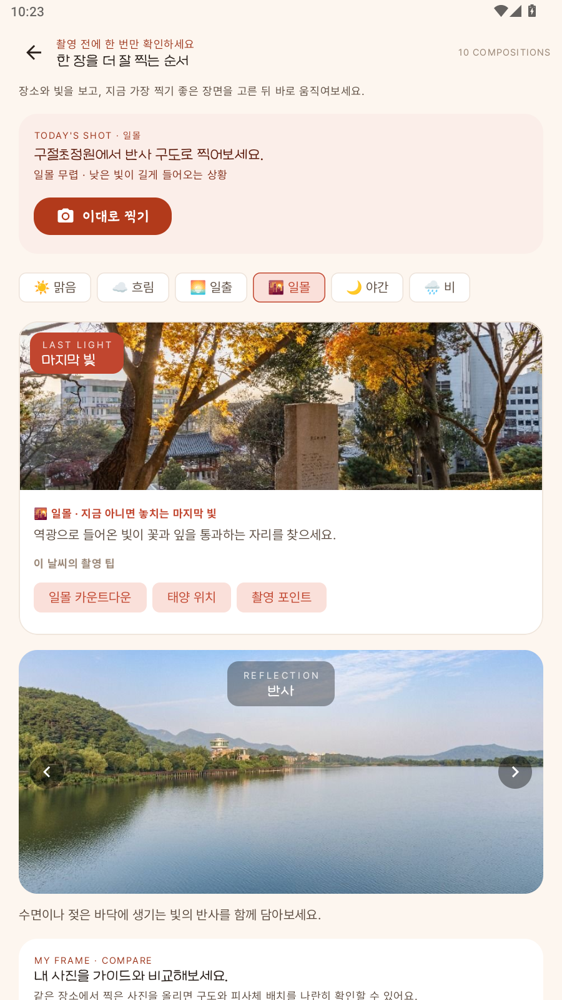
</p>

웹 시안(GuidePage)을 안드로이드로 옮긴 화면입니다. 포즈 가이드가
"몸을 어떻게"에 답한다면, 시선 가이드는 **"프레임을 어떻게"**에 답합니다.
화면의 순서가 곧 사용 순서입니다 — 오늘의 추천 한 장 → 구도 캐러셀 →
내 사진 비교 → 촬영 포인트·시그널.

- **오늘의 추천 한 장** — 홈에서 넘어온 장소의 말로 시작합니다.
  `정읍 김명관 고택에서 실루엣 구도로 찍어보세요.` 장소의 촬영 특성이
  첫 구도를 정합니다 — 대칭 장소는 대칭으로, 중앙 구도 장소는 프레임 인
  프레임으로, 삼분할 장소는 물가면 반사·해질 무렵이면 실루엣·그 외에는
  리딩라인으로
- **날씨 여섯이 실제로 바꾸는 구간** — 예전에는 날씨 탭을 눌러도 문구만
  갈리고 사진과 구도는 그대로였습니다. 지금은 탭 하나가 다섯을 한꺼번에
  바꿉니다 — 참고 사진과 라벨(`REFLECTION · 반사`), 그 사진에서 볼 것
  한 줄, 그 날씨에만 쓰는 촬영 팁 두셋, MY FRAME 복습 질문, 그리고 탭의
  색. 아래 구도 캐러셀도 그 날씨의 구도로 함께 옮겨 갑니다

  | 날씨 | 참고 사진 (관광공사 실사진) | 라벨 | 전용 팁 | 복습 질문 |
  |---|---|---|---|---|
  | ☀️ 맑음 | 처마 그림자가 진 고택 | SHADOW · 그림자 | 빛 방향 보기 · 구도 가이드 · 그림자 찾기 | 그림자 위치가 잘 맞았나요? |
  | ☁️ 흐림 | 안개 낀 내장산 | SOFT LIGHT · 부드러운 빛 | 인물 구도 · 건축 디테일 · 색 찾기 | 인물과 배경 비율은 어땠나요? |
  | 🌅 일출 | 능선 위 넓은 하늘 | FIRST LIGHT · 첫 빛 | 해 위치 보기 · 여백 가이드 · 골든타임 | 첫 빛이 닿은 곳을 어디에 두셨나요? |
  | 🌇 일몰 | 역광에 물든 성황산 은행나무 | LAST LIGHT · 마지막 빛 | 일몰 카운트다운 · 태양 위치 · 촬영 포인트 | 노을과 인물의 위치는 어땠나요? |
  | 🌙 야간 | 등불이 켜진 정읍사 | NIGHT LIGHT · 빛 | 야간 촬영모드 · 빛 찾기 · 휴대폰 고정 안내 | 빛과 어둠의 균형은 어땠나요? |
  | 🌧️ 비 | 잔잔한 수면 | REFLECTION · 반사 | 반사 찾기 · 빗방울 찍기 · 비 그친 직후 알림 | 반사되는 영역을 잘 활용했나요? |

- **구도 10종 캐러셀** — 대칭 · 실루엣 · 반사 · 리딩라인 · 프레임 인
  프레임 · 탑뷰 · 여백 · 움직임 · 레이어드 · 반복 패턴. 예시 사진은 전부
  정읍의 **관광공사 실사진**이고, **한 구도에 한 장**입니다.

  > 원래는 14종이었습니다. 그런데 사진은 열 장뿐이라 넷은 남의 사진을
  > 빌려 썼고("레이어드"와 "프레임 인 프레임"이 같은 창틀 사진, "대각선"이
  > 단풍터널), 빌리지 않은 것도 사진과 이름이 어긋났습니다("클로즈업"
  > 자리에 고택 전경). 구도를 가르치는 화면에서 사진이 그 구도가 아니면
  > 가르치는 것이 틀린 것이 됩니다. 그래서 **사진이 실제로 보여 주는
  > 구도**를 기준으로 다시 짜고, 맞는 사진이 없는 넷은 뺐습니다. 없는
  > 사진을 채우려고 다른 지역 사진이나 생성 이미지를 넣지는 않았습니다.
- **내 사진 비교** — 같은 장소에서 찍은 사진을 올리면 가이드 컷과
  나란히 놓입니다. 구도는 글이 아니라 **내 사진 옆에 놓고 볼 때**
  가장 빨리 배워집니다
- 구도 · 빛 · 움직임 · 체크 탭 카드는 뺐습니다. 구도 방향과 요령은
  캐러셀 아래 설명과 촬영 포인트에 이미 있어 같은 말을 한 화면에서 두 번
  하고 있었습니다.
  "어디에 서야 하는지"는 이제 카메라 화면의 구도 가이드가 그림으로 답합니다
- **실전 촬영 미션은 뺐습니다** — 현장 체크 셋과 세 위치 사진 셋을 채우는
  시트였습니다. 찍자고 눌렀는데 체크리스트가 나오면 한 단계가 더 생기고,
  현장에서 사진을 칸에 넣는 일은 촬영이 아니라 앱을 조작하는 일이었습니다.
  "이대로 찍기"는 이제 바로 카메라로 갑니다. 무엇을 볼지는 촬영 포인트와
  시그널이, 어디에 설지는 카메라의 구도 가이드가 답합니다

### 8. 출사 기록 · 일기

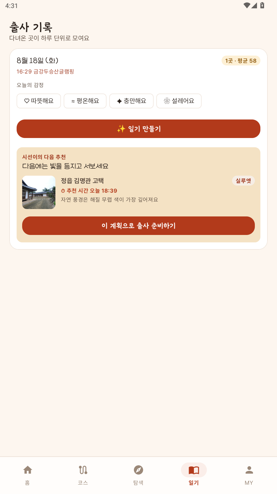

**촬영 → 기록 → 일기 → 공유**가 한 줄로 이어집니다.

- 촬영 화면에서 셔터를 누르면 **자동으로 방문 기록**이 남고 사진이 붙습니다.
  사진을 찍었다는 건 그 자리에 있었다는 뜻이니까요. 시선 가이드의
  실전 미션에서 찍은 컷도 같은 장소의 기록이 됩니다
- **다녀왔어요는 손으로 누르지 않습니다.** 상세 화면의 출사 적합도 아래
  항상 보이는 그 자리는 이제 촬영 기록을 비추는 표시입니다 — 기록이 없으면
  `아직 안 다녀왔어요 · 찍으면 저절로 기록돼요`(누르면 촬영 화면), 있으면
  `다녀왔어요 · 9월 3일 촬영`(누르면 일기). 촬영하고 돌아오는 순간 바뀝니다.
  수동 체크를 없앤 이유는 둘입니다: 검색만 해 본 곳과 실제로 찍고 온 곳이
  섞이지 않고, GPS 상시 권한 없이도 "그 자리에 있었다"는 증거(사진)가 남습니다.
  몇 주 전 기록에 오늘 사진이 붙어 옛 날짜로 들어가지 않도록, 사진은
  3시간 안의 기록에만 붙고 그보다 오래됐으면 오늘 기록을 새로 만듭니다
- **무엇을 찍었는지도 보입니다.** 다녀왔어요 바로 아래에 그 장소에서 찍은
  사진이 전부 가로로 늘어서고(`내가 찍은 사진 3장`), 누르면 그 장부터
  크게 넘겨 보며 포토 프레임으로 바로 보낼 수 있습니다. 예전에는 기록에
  사진 한 장만 남아 한 자리에서 세 장을 찍어도 두 장은 앱이 잊었는데,
  이제 사진은 전부 따로 쌓이고 방문 기록에는 첫 장만 대표로 남습니다.
  띠에서 꾹 누르거나 크게 보기의 휴지통으로 한 장씩 지울 수 있고(기록과
  갤러리에서 함께), 마지막 한 장까지 지우면 그 방문 기록도 함께 사라져
  다녀온 곳 목록에서 빠집니다. 갤러리에서 따로 지운 사진은 띠와 MY 탭
  아카이브에서 저절로 빠집니다(방문 기록은 남습니다)
- **다녀온 곳 목록은 한 곳에 한 줄입니다.** 같은 곳을 두 번 가면 최근
  방문을 앞세우고 `2번 다녀옴` 을 붙입니다. 위의 "N곳" 과 아래 줄 수가
  같아야 숫자를 믿을 수 있습니다
- 하루 단위로 묶여 **일기 초안**이 생성됩니다 (Gemini, 실패 시 템플릿 폴백)
- **그날 찍은 사진 줄**이 함께 붙습니다
- **고치기** — LLM 이 쓴 문장이 사실과 다를 수 있고, 무엇보다 "내 일기"라면
  내가 고칠 수 있어야 합니다
- **오늘의 감정 (시안)** — 따뜻해요 · 평온해요 · 충만해요 · 설레어요.
  일기 본문과 달리 감정은 고르는 것이라 글자로는 안 쓰게 됩니다.
  누르면 그 날짜에 저장됩니다
- **편지지 위의 본문 (시안)** — 일기 본문이 카드보다 한 톤 노란 종이 위에
  앉아 "앱이 만든 정보"가 아니라 "내가 쓴 글"로 읽힙니다. 제목 옆 알약이
  이번 달에 며칠을 기록했는지 말합니다
- **시선이의 다음 추천 (시안)** — 가장 최근 기록 카드 아래에 다음 출사
  한 곳이 붙습니다. `다음에는 빛을 등지고 서보세요` 같은 머리 문장은
  추천 구도가 정하고, 장소는 **이미 다녀온 곳을 뺀 뒤 물가(반사)를
  먼저, 없으면 점수 높은 곳**을 고릅니다. 전부 결정론 계산이고 사진은
  관광공사 실사진입니다. **이 계획으로 출사 준비하기**를 누르면 한 곳짜리
  출사 일정으로 저장됩니다 — 기록이 다음 출사로 이어지는 자리입니다

<br clear="right" />

### 9. 정읍의 순간을 담다 — 포토 프레임 · 네컷

<p>
  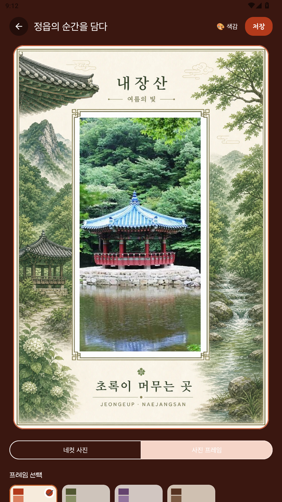
  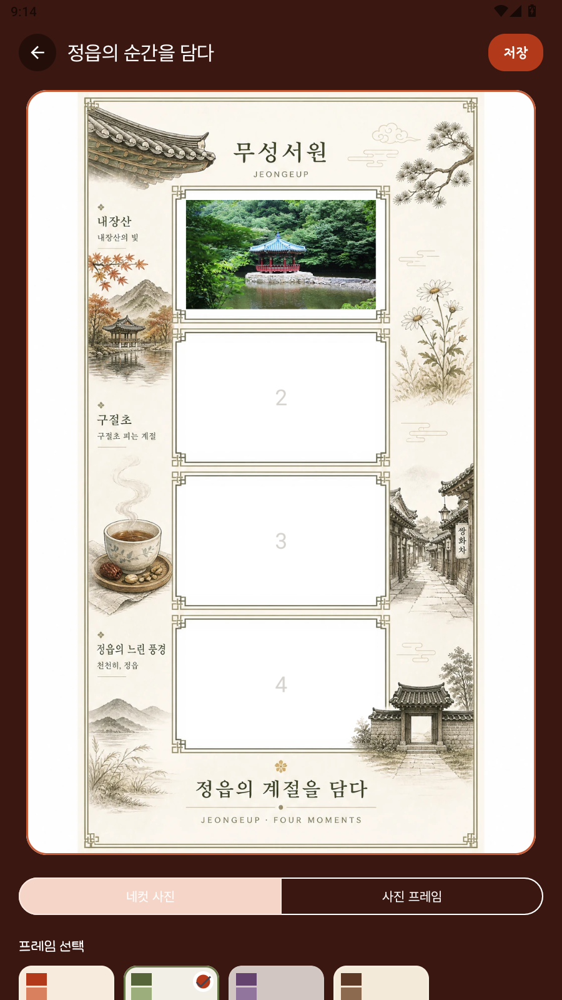
</p>

사진은 찍고 끝이 아니라 **남에게 보여 주는 것으로 마무리**됩니다.
그때 "어디서 찍었는지"가 사진에 같이 붙어야 정읍이 알려집니다.

- **수묵 일러스트 아트워크 프레임** — 시안 원본 그림을 그대로 씁니다.
  흰 사진 창만 투명하게 뚫은 WebP 를 두고 사진을 창 뒤에 깔아 합성하므로,
  찻잔의 김 · 들꽃 · 처마 같은 장식이 **사진 위로 자연스럽게 겹칩니다**.
  창 좌표는 원본의 흰 영역을 스크립트로 측정해 코드에 박았습니다
- 테마 4종 — **내장산 · 무성서원 · 구절초 · 쌍화차 거리**
  (색 이름이 아니라 장소 이름을 씁니다. 고르는 행위가 "어떤 색으로 할까"가
  아니라 "어디서 찍은 사진으로 할까"가 되도록)
- **네컷 사진** — 무성서원은 세로 스트립, 나머지 테마는 2×2 격자로
  아트워크의 창 배치를 따릅니다. 사진이 네 장보다 적으면 남는 칸은
  빈 인화지에 옅은 순번만 둡니다 — 더 채울 수 있다는 뜻이니까요
- 무성서원 1컷 아트워크는 아직 없어 기존 코드 폴라로이드(이중 금선 ·
  구름 문양 · 수묵 산세 · 장소명 · 날짜)로 그립니다. 이 프레임에서는
  **장소 이름 바꾸기** 버튼으로 폴라로이드에 찍히는 장소명을 직접
  고칠 수 있습니다 — 장소명이 그려지지 않는 아트워크 프레임에서는
  버튼 자체를 숨깁니다
- **보이는 부분 조정** — 프레임 창과 사진의 비율이 달라 어딘가는 잘립니다.
  전에는 무조건 가운데를 남겨서 한쪽에 선 사람이 잘려 나갔습니다. 미리보기나
  `보이는 부분 조정` 버튼을 누르면 창 비율의 밝은 칸 뒤에서 사진을 끌어
  옮기고 두 손가락으로 키울 수 있고, 그 부분이 저장본에도 그대로 들어갑니다.
  네컷은 몇 번째 사진인지 먼저 고릅니다. 고른 부분은 사진 전체에 대한
  비율(0~1)로 두어 원본 크기나 프레임을 바꿔도 가운데가 유지됩니다
- 다른 앱에서 **"공유 → 정읍 시선"** 으로 사진을 보낼 수도 있습니다

### 10. 미션 · 스탬프북 — 방문이 아니라 장면을 센다

<p>
  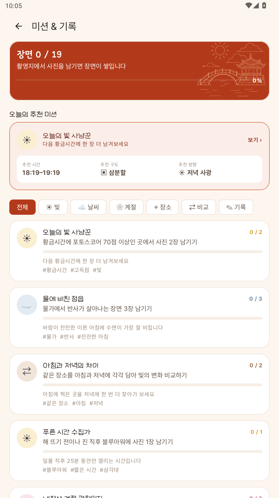
  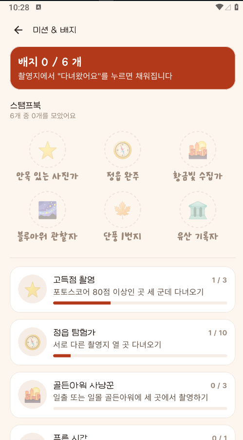
</p>

미션 구조를 다섯 단계에 걸쳐 갈아엎었습니다. 핵심 전환은 하나입니다 —
**"몇 군데 다녀왔나"가 아니라 "어떤 장면을 남겼나"를 센다.**

방문 수를 세는 미션은 관광 스탬프 랠리입니다. 이 앱은 출사 앱이라,
같은 장소라도 황금시간의 실루엣과 잔잔한 아침의 반사는 **다른 장면**으로
세는 것이 맞습니다. 그래서 진행 단위가 `장면 0 / 19`입니다.

- **도메인 재설계** — 미션 판정의 입력이 방문 기록이 아니라
  "언제 · 어디서 · 어떤 빛에서 찍었나"입니다. 별도 완료 플래그를 저장하지
  않고 기록에서 **매번 다시 판정**하므로, "완료 처리를 깜빡해 배지가 안
  나오는" 종류의 버그가 원천적으로 없습니다
- **탐색 화면** — 전체 미션이 수집판(격자)이 아니라 **탐색 목록**입니다.
  맨 위에 **오늘의 추천 미션** 하나 — 지금의 빛과 남은 진행으로 골라
  추천 시간 · 구도 · 방향까지 붙습니다. "다음에 뭘 해볼까"를 고르는 자리와
  "지금 뭘 하지"에 답하는 자리를 갈랐습니다
  - 필터 칩 — **빛 · 날씨 · 계절 · 장소 · 비교 · 기록**. 미션의 성격
    (황금시간을 노리는 것, 물가 반사를 모으는 것, 아침저녁을 비교하는 것)이
    곧 분류입니다
  - 각 미션에 진행 바 · 한 줄 힌트(`바람이 잔잔한 이른 아침에 수면이 가장
    잘 비칩니다`) · 해시태그
- **상세 화면과 연결** — 촬영지 상세에 "이 장소에서 바로 할 수 있어요"로
  이 장소에서 되고 아직 안 끝났고 지금 빛에 맞는 미션이 **최대 셋** 나옵니다.
  같은 missionId 를 쓰므로 거기서 사진을 남기면 전체 진행률도 함께 올라갑니다
- **스탬프북** — 스탬프가 도장 아이콘이 아니라 **손그림 배지**입니다.
  이름도 "미션 3 완료"가 아니라 **황금빛 수집가 · 수면의 관찰자 · 블루아워
  관찰자** 같은 수식어입니다. 모은 것이 숫자가 아니라 호칭이 되도록.
  미획득 배지는 숨기지 않고 **흐리게** 보여 줍니다 — 빈 칸이 아니라
  채울 자리로 읽히게. 상단에 장면 수 · 스탬프 · 다녀온 곳 · 이번 계절 요약

> 원안은 "쌍화차 인증" 같은 단순 방문 미션이었는데, **빛 조건**을 판정에
> 넣었습니다. 그래야 "언제 가느냐"가 의미를 갖고, 이 앱이 스탬프 앱이 아니라
> 출사 앱으로 남습니다.

<br clear="right" />

### 11. 정읍 사계절 촬영 가이드

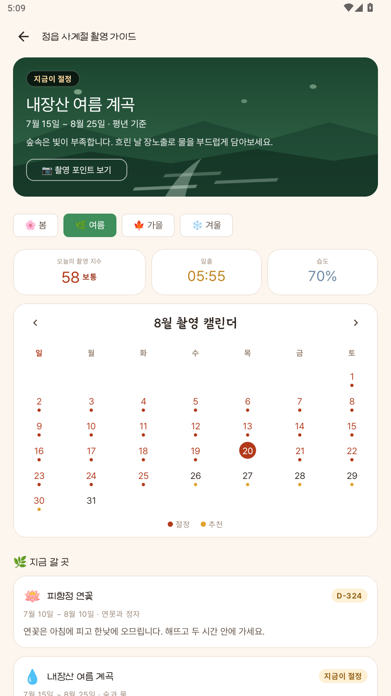

축제가 아니라 **피사체의 절정 시기**가 기준입니다.

- **계절 히어로 (시안)** — 고른 계절의 대표 피사체가 그 계절의
  **관광공사 실사진**(봄 꽃 · 여름 내장산 계곡 · 가을 단풍 · 겨울 내장산)
  위에 크게 얹힙니다. 어두운 스크림을 깔아 어떤 사진에서도 흰 글씨가
  읽힙니다. 지금이 절정이면 배지가 그렇다고 말하고, 아니면 D-day 를 답니다
- **오늘의 촬영 지수 · 일출 · 습도** — 지수는 지금 촬영지들의 포토스코어
  최고점입니다. "오늘 어딘가는 이만큼 나온다"가 평균보다 나갈 이유를
  잘 말해 줍니다
- **N월 촬영 캘린더** — 절정(단풍색)과 절정 앞뒤 닷새의 추천(황금색)을
  점으로 구분합니다. **날짜를 누르면 그날에 맞는 피사체로 히어로가
  바뀝니다** — 그날이 절정인 피사체를 먼저, 없으면 그날 기준으로 절정이
  가장 가까운 피사체를 올리고, 배지가 `8월 26일 기준 D-25`처럼 그날
  기준으로 말합니다. 고른 날짜는 테두리 원으로 표시됩니다
- 홈에서는 오른쪽 위 **날짜 알약**과 퀵 액션의 **캘린더**로 들어옵니다
- 계절을 고르면 **그 계절의 색**으로 켜집니다. 봄은 벚꽃 분홍, 여름은
  내장산 신록의 초록, 가을은 은행잎 주황, 겨울은 얼음의 시린 파랑.
  넷 다 대표색(단풍 빨강)이면 무엇을 골랐는지 색으로 알 수 없고,
  겨울을 골랐는데 칩이 단풍색이 되는 어긋남도 생깁니다
- D-day 안내 (`구절초 개화까지 D-14`)
- 그 시기에 **어떻게 찍는지** 한 줄 팁
- 계절을 고르면 달력이 그 계절로 넘어가되, **지금이 그 계절 안이면 첫 달이
  아니라 이번 달**을 폅니다. 8월에 여름을 열었는데 6월이 나오면 절정 점을
  보러 두 번을 더 넘겨야 합니다

> 절정 기간이 며칠에 걸쳐 있는지는 목록만으로 감이 오지 않습니다.
> "10월 19~21일"을 읽는 것과 달력에서 그 사흘에 점이 찍힌 걸 보는 것은 다릅니다.

<br clear="right" />

### 12. MY — 나의 시선

<p>
  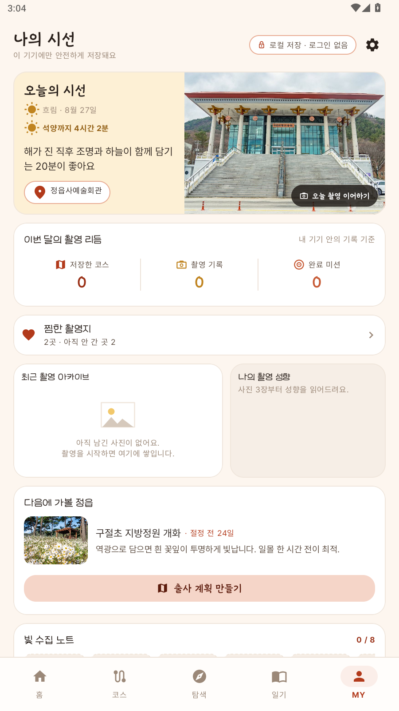
  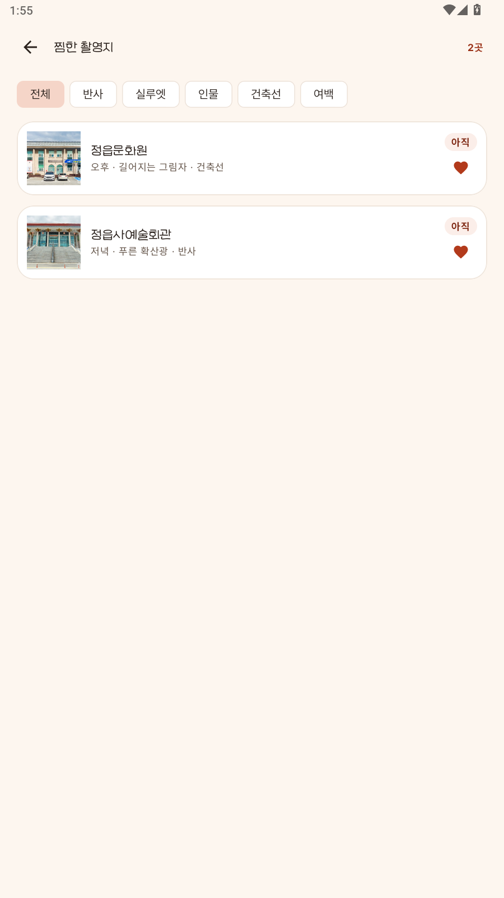
  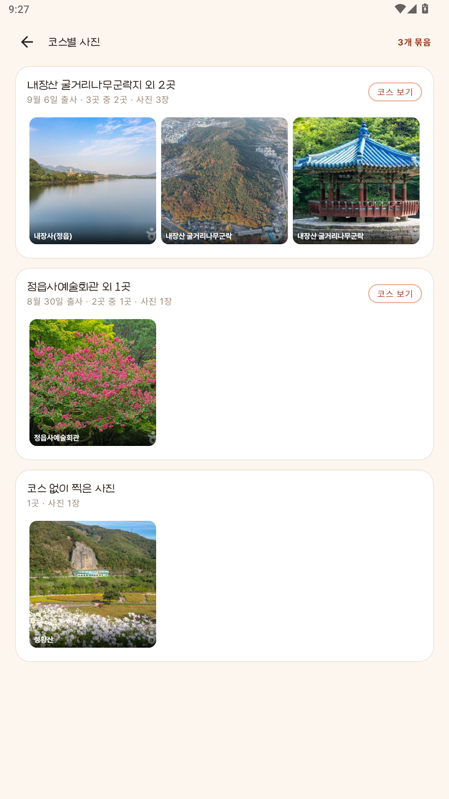
  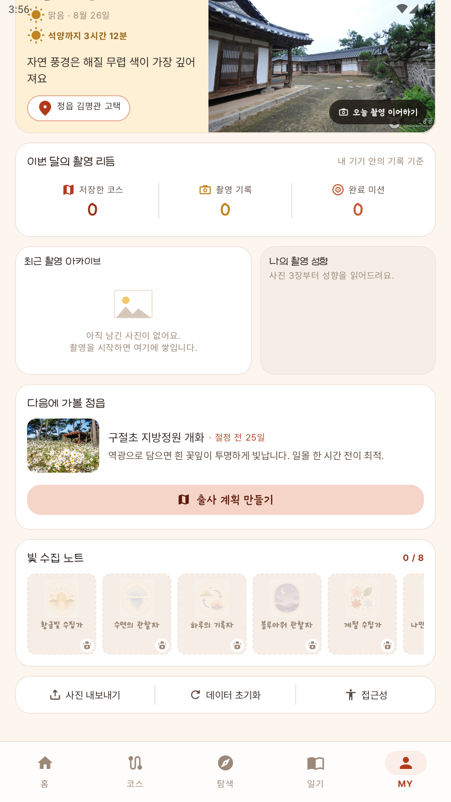
  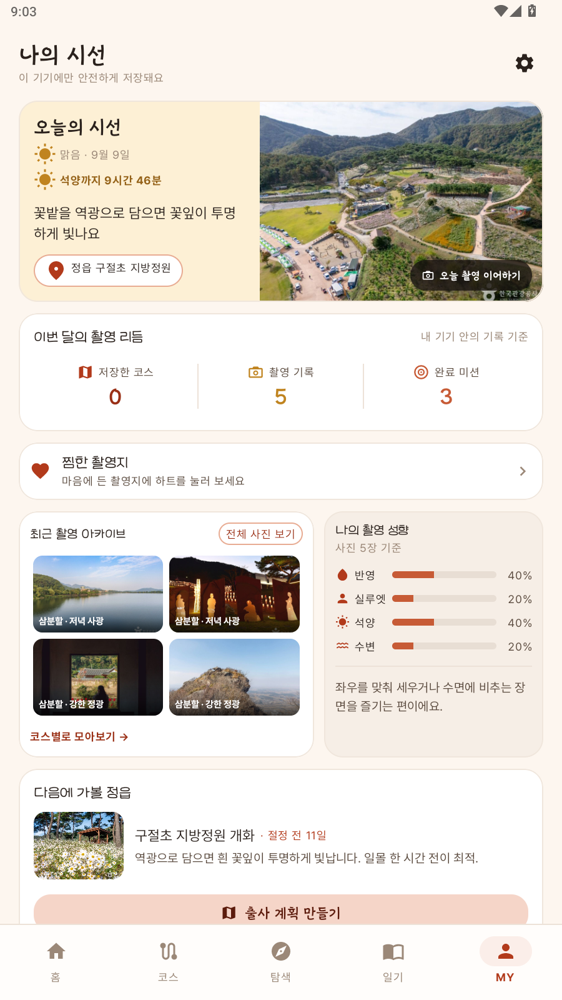
</p>

로그인이 없으므로 프로필(아바타 · 레벨 · 가입일)을 두지 않았습니다.
계정이 아니라 **기록이 곧 프로필**입니다. 제목 아래 `이 기기에만 안전하게
저장돼요` 한 줄이 그 사실을 말합니다. 처음에는 `🔒 로컬 저장 · 로그인 없음`
배지도 함께 달았는데, "로컬 저장"은 개발자 말이고 "로그인 없음"은 굳이
알릴 일이 아니라 뺐습니다. 같은 뜻을 두 번 말할 이유도 없었습니다.

머리글은 스크롤해도 상태바 밑으로 들어가지 않습니다. 이 화면은 사진이
위까지 깔리는 히어로가 없으므로 상태바 자리는 바탕색으로 비워 두고,
내용은 그 아래에서 잘리게 했습니다(코스 입력 화면도 같습니다).

찜한 촬영지는 id 만이 아니라 **장소 정보를 스냅샷으로 함께** 저장합니다.
홈 목록은 관광공사 API 에서 받은 것이라 관광공사가 항목을 내리면 예전에
찜한 곳이 목록에서 사라져, "찜 3곳"인데 들어가면 2곳만 보이는 일이
있었습니다. 이제 목록은 홈 목록 → 스냅샷 → 관광공사 상세 조회 순으로
찾고, 관광공사가 "그런 장소는 없다"고 답한 찜은 조용히 지워 개수와
목록이 다시 맞습니다(네트워크 오류는 없는 것과 다르므로 지우지 않습니다).

화면은 위에서 아래로 **시간축이 넓어지게** 놓았습니다 —
지금 → 이번 달 → 다음 계절 → 모아 온 전부.

- **오늘의 시선** — 지금 날씨 · `석양까지 3시간 12분` · 추천 촬영지와
  그 장소의 촬영 한 줄. 빛 정보는 홈이 이미 받아 둔 값을 그대로 써서
  두 화면의 숫자가 어긋나지 않습니다. 카드를 누르면 그 장소의 상세로
  갑니다 — 사진과 이름을 보여 주면서 눌러도 아무 일이 없으면 닫힌
  화면처럼 느껴집니다
- **이번 달의 촬영 리듬** — 저장한 코스 · 촬영 기록 · 완료 미션.
  `내 기기 안의 기록 기준`이라고 밝혀, 서버 통계로 오해되지 않게 합니다
- **찜한 촬영지** — 하트는 목록 · 상세 · 지도 어디서나 누를 수 있었는데
  정작 모아 볼 자리가 없었습니다. 다시 못 찾는 저장은 없는 기능과
  같습니다. 단순 목록으로 두지 않은 것은 '저장 후 방치' 때문입니다 —
  촬영 목적 필터(지도와 같은 축)로 거르고, 각 줄에 **다녀옴 / 아직**
  배지를 달고, 오늘 빛이 그 장소의 최적 구간과 맞으면
  `지금 빛과 맞아요`를 붙여 맨 위로 올립니다. MY 요약 줄도 개수가 아니라
  `8곳 · 아직 안 간 곳 5`로 말합니다 — 남은 수가 곧 나갈 이유입니다
- **최근 촬영 아카이브** — 사진 격자에 `구도 · 빛` 태그. 사진 한 장을
  누르면 포토 프레임으로, **카드의 어디를 눌러도** 전체 사진 목록으로
  갑니다. 카드 생김새가 눌리는 카드와 같은데 제목 언저리만 죽어 있으면
  앱이 고장 난 것처럼 읽힙니다. 사진이 없을 때는 남의 사진으로 채우지
  않고 빈 액자 그림과 `촬영 시작하기`를 둡니다 — 보여 줄 게 없을 때야말로
  나갈 이유가 필요합니다
- **코스별 사진** — 아카이브 카드의 `코스별로 모아보기`. 이 줄은 찍은
  사진이 한 장이라도 있을 때만 보입니다 — 빈 화면으로 가는 문은 두지
  않습니다. 다녀온 곳이 장소 단위, 일기가 하루 단위라면 이 화면은
  **코스 단위**입니다 —
  "그날 그 코스를 돌면서 뭘 찍었지"에 답합니다. 코스마다 카드 하나에
  `9월 6일 출사 · 3곳 중 2곳 · 사진 3장`과 세 줄 격자. 사진에는 어느
  코스를 돌다 찍었는지가 남지 않으므로(촬영 화면은 장소만 압니다) 여기서
  되짚습니다 — 그 장소가 정거장인 코스 가운데 **출사 예정일이 찍은 날과
  가장 가까운 코스 하나**에만 넣습니다. 두 코스에 다 보이면 사진 수가
  실제보다 많아집니다. 어느 코스에도 없는 장소에서 찍은 사진은 맨 아래
  `코스 없이 찍은 사진`으로 따로 묶습니다. 버리면 사진이 사라진 것이
  됩니다. 사진을 누르면 그 코스 사진만 넘겨 보고, 코스 이름을 누르면
  타임라인으로 갑니다
- **나의 촬영 성향** — 내가 찍은 사진을 **기기 안에서 직접 읽어** 네 가지로
  세고 각각 몇 %인지 막대로 보여 줍니다. 사진은 어디로도 보내지 않습니다 —
  계정 없이 기록을 단말에 두는 앱이라, 사진만 서버로 나가면 앞뒤가 안 맞습니다
  - **수변**: ML Kit 이미지 라벨링(번들 모델, 오프라인)이 사진에서
    호수 · 강 · 폭포 · 바닷가 · 배 같은 라벨을 찾으면. 기본 모델에 "물"
    라벨이 없어 있는 것들로 조합했습니다
  - **반영**: 위아래(수면 반영)나 좌우(건물 대칭)가 거울처럼 되풀이되는지
    밝기로 직접 계산합니다. 축 위쪽 띠와 아래쪽 띠를 뒤집어 맞댄 상관에서
    안 뒤집고 맞댄 상관을 뺀 여유를 봅니다 — 하늘·바다처럼 가로줄만 있는
    사진은 뒤집어도 비슷해서 그냥 상관만 보면 반영으로 잘못 읽습니다.
    맞대기 전에 줄 평균을 양방향으로 빼서 "위는 밝고 아래는 어둡다" 같은
    큰 기울기를 걷어 냅니다. 관광공사 실사진 스무 장으로 문턱을 맞췄고,
    수면 반영·창틀 프레임·가운데 계단은 잡히고 보통 풍경은 안 잡힙니다
  - **실루엣**: 밝기 분포가 어둠과 밝음 양쪽으로 갈라져 있고 중간이
    비어 있는지. 해를 등진 형태는 검게, 하늘은 하얗게 남습니다
  - **석양**: 라벨러가 노을을 찾았거나, 찍은 시각이 일출·일몰 골든아워였거나.
    노을이 화면에 안 잡혀도 골든아워에 나가 찍은 사진은 해가 낮을 때
    셔터를 누른 사진입니다
  - 한 장은 한 번만 읽고 결과를 DB 에 둡니다(한 장에 1초 안팎). MY 탭을
    열 때 아직 안 읽은 사진을 뒤에서 읽고, 한 장 읽힐 때마다 막대가 채워집니다.
    읽는 중이면 `사진 5장 기준 · 2장 읽는 중`이라고 밝힙니다
  - 세는 대상은 **직접 찍은 사진이 붙은 방문**뿐입니다. "다녀왔어요"만
    누른 기록은 이동 기록이지 촬영 성향이 아닙니다
  - 읽은 사진이 **3장 미만이면 막대를 보여 주지 않습니다**. 한 장 찍고
    "석양 100%"라고 하면 그건 통계가 아니라 장식입니다
  - 네 축 중 가장 높은 것 하나만 문장으로 바꿉니다 — `물이 있는 자리를
    먼저 찾는 편이에요`처럼. 백분율만 두면 "그래서 나는 어떤 사람인가"가
    남지 않습니다
  - 전에는 장소 이름과 시각으로 짐작했습니다(피향정에서 찍으면 무조건
    반영·수변). 그건 "어디 갔나"지 "무엇을 찍었나"가 아니라서 바꿨습니다
- **다음에 가볼 정읍** — 가장 가까운 절정과 D-day(`구절초 지방정원 개화 ·
  절정 전 25일`), 그 시기 촬영 요령, 관광공사 실사진
- **빛 수집 노트** — 미션 여덟 개를 우표처럼. 못 받은 칸도 흐리게 보여
  줍니다. 무엇을 모을 수 있는지 알아야 모으고 싶어집니다
- **사진 내보내기 · 데이터 초기화 · 접근성** — 셋 다 실제로 동작합니다.
  내보내기는 공유 시트로 원본을 넘기고(사진을 한 벌 더 만들지 않습니다),
  초기화는 기록만 지우고 **갤러리 사진과 글씨 크기 설정은 남깁니다**.
  고객센터는 두지 않습니다 — 응대 창구가 없는데 버튼만 있으면 거짓말입니다

### 13. 온보딩 · 큰 글씨 모드 (시니어 접근성)

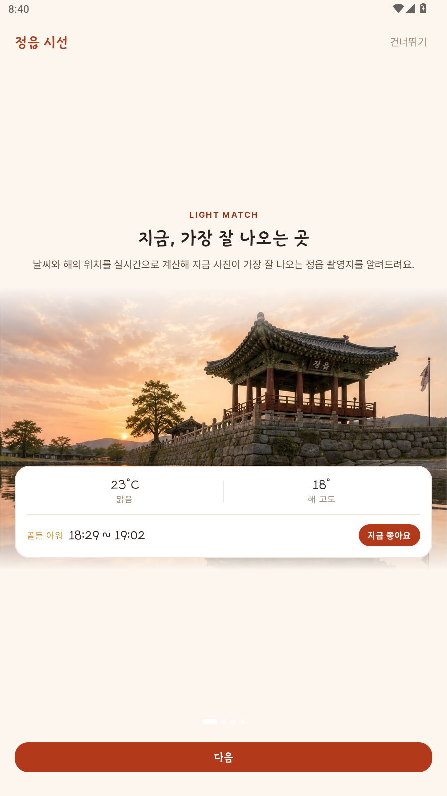

온보딩 네 장이 앱의 핵심 흐름을 순서대로 미리 보여 줍니다 —
**LIGHT MATCH**(지금 조건 카드) → **LIGHT ROUTE**(하루의 빛 타임라인) →
**YOUR SISEON**(구도 썸네일 + 보기 모드 선택) → **AFTER THE FRAME**
(오늘의 기록 · 다음 출사 추천). 기능을 글로 설명하는 대신 각 장에
그 기능의 실제 얼굴(날씨·해 고도·골든 아워 카드, 일출~일몰 타임라인,
실루엣·반영·리딩라인 예시)을 예시 값 그대로 얹었습니다. 장면 사진은
전부 **관광공사 실사진**(내장산 우화정 · 구절초 정원 · 정읍 허브원 등)
입니다 — 그린 그림은 앱의 데이터 시각화 자리에만 남겨 뒀습니다.

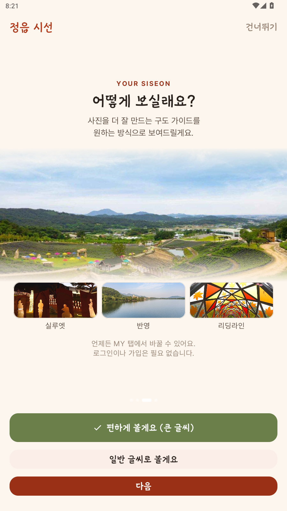

보기 모드(큰 글씨 / 일반)는 3장에서 고릅니다. 누르면 **그 자리에서
바로 적용**됩니다 — 화면이 큰 글씨로 다시 그려지고, 고른 쪽에 체크가
붙습니다. 전에는 누르면 마지막 장으로 넘어갔는데, 큰 글씨를 눌렀는데
글씨는 그대로고 화면만 바뀌니 뭐가 된 건지 알 수 없었습니다. 고른 뒤
`다음`으로 마지막 장을 보고 **다음 출사 계획 보기**로 들어갑니다.
그래서 두 버튼은 `편하게 볼게요(큰 글씨)` · `일반 글씨로 볼게요` 로
**시작이 아니라 보기 방식**을 말합니다. 로그인·회원가입 단계는 없습니다.

큰 글씨 모드를 켜면 글씨 크기도 `크게`로 같이 올라갑니다. 이 모드는
원래 테마(색·버튼·여백)와 탭 구성만 바꿨는데, 이름이 "큰 글씨"인데
글씨는 안 커지는 셈이었습니다. 끌 때는 그렇게 올라간 것만 되돌리고,
직접 `매우 크게`를 골랐다면 그 선택은 남깁니다.

탭 5개 → 3개, 글자·버튼 확대, TTS 0.85배속. 카드 안쪽 여백은 시니어
전용 카드에만 줍니다 — 테마 기본값으로 모든 카드에 얹었더니 일반 화면의
카드는 여백이 두 겹이 되고, 히어로 사진이 안으로 밀리고, 코스 탭의 날짜
알약은 글자 들어갈 자리가 없어 비어 있었습니다.
출사는 은퇴 후 취미로 시작하는 사람이 많은 분야라 접근성을 곁다리로 두지
않았습니다.

MY 탭에 **앱 사용법 다시 보기**를 뒀습니다. 온보딩은 처음에 대개 건너뛰는데,
나중에 다시 보고 싶어도 길이 없었습니다. 처음 봤던 화면을 그대로 다시
띄우되, 다시 보기로 열었을 때는 건너뛰기가 앱을 다시 시작하지 않고 조용히
닫힙니다 — **보러 온 것이지 설정하러 온 것이 아니라서**입니다. 거기서
모드를 바꿨다면 돌아온 본 화면이 스스로 다시 그립니다.

<p align="left">
  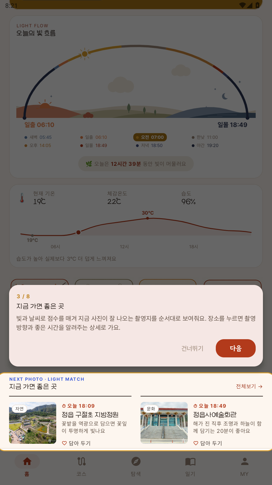
  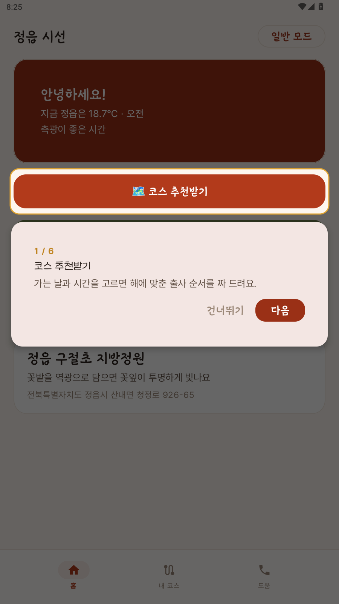
</p>

**첫 실행 버튼 안내(코치마크).** 온보딩이 "이 앱이 무엇인지"라면 이것은
"어디를 누르면 무엇이 되는지"입니다. 온보딩을 마치고 홈에 처음 왔을 때
화면을 어둡게 덮고 버튼 하나씩 밝게 뚫어 옆에 설명 한 장을 붙입니다 —
촬영 캘린더 → 빠른 이동 네 칸 → 지금 가면 좋은 곳 → 시선 가이드 →
코스·탐색·일기·MY 탭, 여덟 장. 큰 글씨 모드는 홈의 큰 버튼 셋과
오늘 추천 장소, 내 코스·도움 탭 여섯 장입니다. 스크롤 아래 있는 자리는
먼저 끌어올린 뒤 뚫습니다. 한 번 보면 다시 뜨지 않고, **앱 사용법 다시
보기**를 끝까지 보면 다시 켜집니다. 덮개 아래로는 터치를 흘리지 않습니다 —
안내 중에 실제 버튼이 눌려 화면이 바뀌면 다음 안내가 가리킬 자리가
사라집니다.

---

## 설계 기록 — 갈아엎은 것들

만든 것보다 **버린 것**이 더 많은 것을 설명합니다. 남긴 이유를 적어 둡니다.

### 하루의 빛을 그리는 방법 (세 번 바꿈)

| 시도 | 문제 |
|---|---|
| 가로 막대 | "골든아워까지 얼마 남았나"는 읽히지만 **해가 어디쯤 떠 있나**는 안 보임 |
| 반원 (자정~자정) | 해의 높이가 보이게 됐지만 세로로 높아 **카드가 화면의 3분의 1**을 먹음 |
| 납작한 호 (일출~일몰) | 카드는 짧아졌지만 **새벽·저녁·야간이 그림에서 사라짐** |
| **눕힌 호 + 지형** | 24시간을 다 담되 납작하게. 아래에 땅을 깔아 그림이 되니 높이가 아깝지 않음 |

구간 이름도 세 번 옮겼습니다. 호를 따라 곡선 아래 정확한 위치에 놓아 봤는데,
골든아워·블루아워가 30분짜리라 **왼쪽 끝에 이름 넷이 몰려** 어긋난 높이로
쌓이고 자정 쪽 "야간"은 카드 밖으로 잘렸습니다. 4열 2행 격자로 옮기니
날짜가 바뀌어 구간 길이가 달라져도 자리가 흔들리지 않습니다. 위치로 잇던
이름과 띠는 **색 점**으로 잇습니다.

### 같은 뜻의 동작이 둘로 갈려 있었다

"장소 하나를 담아 둔다"를 두 가지가 하고 있었습니다.

- **찜(♡)** — 단말에 contentId 를 담아 둠
- **출사 계획에 담기** — 정거장 하나짜리 **코스**를 만들어 코스 목록에 넣음

두 번째가 문제였습니다. 홈·지도·일기에서 누를 때마다 1곳짜리 코스가
하나씩 새로 생겨, "내 출사 코스"가 `명봉도서관`, `정읍 김명관 고택`처럼
한 곳씩 든 코스로 채워졌습니다. **담은 곳들이 모여 한 계획이 되는 것이
아니라 저장할 때마다 따로 놀았고**, 같은 곳을 두 번 누르면 같은 카드가
둘 생겼습니다.

**찜 하나로 합쳤습니다.** 장소를 담는 일은 찜이 하고, 코스는 여러 곳을
빛으로 세운 것만 코스로 남습니다. 담아 둔 곳으로 코스를 짜는 길은 코스
탭의 '직접 고르기'입니다 — 찜한 곳을 골라 담으면 순서는 빛이 세웁니다.

코스 저장에도 같은 것이 하나 걸려 있었습니다. '저장'을 두 번 누르거나
뒤로 갔다 다시 들어와 또 누르면 똑같은 카드가 둘 생겼습니다. 날짜와
정거장 구성(순서 포함)이 같으면 같은 코스로 보고 다시 넣지 않습니다.
그때는 오류가 아니라 **사용자가 바라던 상태**이므로 조용히 성공으로
돌려줍니다.

### 기준을 밝히지 않은 숫자는 오해를 부른다

탐색 카드의 "차로 8분"은 **내 위치가 아니라 정읍 시내(시청 인근)** 에서
잰 값이었는데, 화면에는 그냥 "차로 8분"이라고만 적혀 있었습니다. 누구나
내 위치에서 8분으로 읽습니다.

기준을 내 위치로 바꾸지는 않았습니다. 목록은 대개 집에서 계획을 짤 때
보는 화면이라, 내 위치로 재면 모든 곳이 "차로 180분"이 되어 곳과 곳을
견줄 수가 없습니다. 시내를 원점으로 두면 정읍 안에서의 멀고 가까움이
그대로 읽힙니다. 대신 **"시내에서 차로 8분"** 으로 기준을 말에 넣었습니다.

현장에서 실제로 움직일 때 쓰는 "내 위치 기준"은 지도 시트가 따로
계산합니다 — 그 화면은 이미 정읍에 가 있는 사람이 보는 자리입니다.

### 필터가 문구만 바꾸면 필터가 아니다

시선 가이드의 날씨 탭(맑음·흐림·일출·일몰·야간·비)은 처음에 **문구 넷만**
갈아 끼웠습니다. 참고 사진도, 아래 구도도, 촬영 팁도 그대로였습니다.
탭을 눌러 보면 "TODAY'S SHOT" 한 줄만 바뀌니, 날씨별로 사진이 어떻게
달라지는지는 알 수 없고 **필터가 왜 있는지도 알 수 없었습니다.**

지금은 탭 하나가 다섯을 바꿉니다 — 참고 사진과 라벨, 그 사진에서 볼 것,
그 날씨 전용 촬영 팁, MY FRAME 복습 질문, 탭의 색. 구도 캐러셀까지 함께
옮겨 갑니다. 참고 사진은 여섯 날씨가 전부 다른 장을 씁니다 — 관광공사가
찍은 정읍 실사진 중에서 **그 날씨의 빛에 실제로 맞는 컷**을 골랐습니다.

MY FRAME 도 질문이 날씨마다 다릅니다. `사진을 올려 보세요`로 끝나면 업로드
자체가 목적이 되지만, 맑음에 "그림자 위치가 잘 맞았나요?"를, 비에 "반사되는
영역을 잘 활용했나요?"를 물으면 다음 촬영이 달라집니다.

### 사진이 그 구도가 아니면 가르치는 것이 틀린 것이 된다

시선 가이드는 구도 14종이었는데 참고 사진은 열 장뿐이었습니다. 그래서 넷은
남의 사진을 빌려 썼습니다 — "레이어드"와 "프레임 인 프레임"이 **같은 창틀
사진**, "대각선"이 단풍터널, "시점 전환"이 산 정상. 빌리지 않은 것도
어긋나 있었습니다. "클로즈업" 자리에는 가까이 찍은 것이 하나도 없는 고택
전경이 있었습니다.

구도를 **가르치는** 화면에서 사진이 그 구도가 아니면, 가르치는 내용이 틀린
것이 됩니다. 그래서 사진이 실제로 보여 주는 구도를 기준으로 다시 짰습니다.

| 사진 | 예전 이름 | 지금 이름 | 사진에 실제로 있는 것 |
|---|---|---|---|
| 고택 툇마루 | 클로즈업 | **레이어드** | 앞에 담쟁이, 중간에 인물, 뒤에 기와 — 세 겹 |
| 산 정상 능선 | 낮은 각도 | **여백** | 하늘이 화면의 2/3 |
| 구절초 꽃밭 | 여백 | **반복 패턴** | 흰 꽃의 반복을 노란 우산 하나가 끊음 |
| 단풍터널 | 리딩라인 + 대각선 | **리딩라인** | 소실점 하나 |
| 창틀 | 프레임 인 프레임 + 레이어드 | **프레임 인 프레임** | 문틀 안의 장면 |

14 → 10 으로 줄었습니다. 맞는 정읍 실사진이 생기면 뺀 넷(낮은 각도 ·
클로즈업 · 대각선 · 시점 전환)을 되살립니다. 없는 사진을 채우려고 다른
지역 사진이나 생성 이미지를 넣지는 않습니다 — 이 앱의 사진은 전부
한국관광공사가 정읍에서 찍은 것이라는 약속이 더 중요합니다.

### 같은 분류라는 이유로 같은 추천이 나오던 문제

`SpotFactsTable` 은 정읍 대표 촬영지 여덟 곳만 손으로 정리하고 나머지는
`contentTypeId` 하나로 추정했습니다. 그래서 정읍사예술회관 · 정읍시립미술관 ·
정읍문화원이 **전부 문화시설(14)** 이라는 이유로 방위 · 최적 시간 · 구도가
똑같아졌고, 코스 타임라인 세 칸에 `추천 구도 · 좌우 대칭축`이 세 번
나왔습니다. 추천이 세 번 같으면 추천이 없는 것과 같습니다.

두 곳을 고쳤습니다.

1. **이름의 끝머리를 2차 판별로** — 한국의 장소 이름은 끝머리가 그 장소의
   생김새를 꽤 정확히 말합니다. 미술관은 실내 전시, 회관은 정면 계단,
   저수지는 물, 능선은 하늘. 손으로 정리한 표 → 이름 끝머리 →
   카테고리 기본값 순으로, 뒤로 갈수록 아는 것이 적어지게 두었습니다
2. **구도를 열 종에서 고르되 근거를 겹쳐서** — 장소의 촬영 특성 한 줄이
   이미 "무엇을 보라"고 말하면 그것이 먼저(`능선 위로 하늘을 크게 비우면`
   → 여백), 그런 단서가 없으면 도착 시각의 빛이 정하고(일몰이면 실루엣,
   한낮이면 반복), 둘 다 없을 때만 오버레이 구도로 물러납니다

### 장비 조건은 나갈 이유가 아니다

코스 카드의 한 줄은 그 장소의 최적 시간이 아닐 때 빛 구간의 `hint` 를
그대로 썼습니다. 그런데 그것은 "삼각대가 필요해요"처럼 **장비·조건**입니다.
저녁에 코스를 짜면 세 칸이 나란히 "삼각대가 필요해요"로 채워졌고, 왜 여기를
가는지가 사라졌습니다.

`hint` 대신 `subject` — 그 빛에 **무엇이 찍히는지**를 말하게 바꿨습니다.
`한낮엔 넓은 시야와 지역의 색을 노려보세요`. 같은 자리에 들어가는 한 줄인데
하나는 장비 목록이고 하나는 나갈 이유입니다.

### 분류표의 말과 현장의 말

`Facing.ANY` 의 이름은 "무관"입니다. 분류표에서는 맞는 말인데 문장에 그대로
넣으면 `오전 · 무관에 담기 좋아요` 같은 줄이 나옵니다. 방위가 문장에 들어갈
때 쓰는 이름(`phraseLabel`)을 따로 두어 "어느 방향에서든"으로 말하게 했습니다.
같은 이유로 이모지도 아이콘으로 바꿨습니다 — 🌅 🌄 🌇 은 기기마다 그림이
달라 같은 화면 안에서도 톤이 튀고, 색을 맞출 수 없습니다.

### 시각 표기에서 딱 두 곳만 다르게

구간 이름 옆의 시각은 **그 구간이 시작하는 시각**입니다. 알고 싶은 것이
"몇 시부터 이 빛인가"라서입니다. 두 곳만 예외입니다.

- **일출·일몰 골든아워** — 시작 시각을 적으면 `05:21`이 되는데, "일출"이라는
  낱말에서 기대하는 숫자는 해가 뜨는 `05:52`입니다. 두 값이 어긋나 보이면
  그림 전체를 못 믿게 됩니다
- **야간** — 자정에 잘려 조각이 둘입니다. 저녁 뒤에 오는 쪽(`20:20`)을 씁니다.
  `00:00`은 "오늘 밤 몇 시부터 야간인가"에 답하지 못합니다

### 색이 곧 정보다

세 군데에서 색을 고정값에서 데이터로 바꿨습니다.

- **히어로 카드 바탕** — 단풍 빨강 고정 → 지금의 빛 구간
- **계절 칩** — 대표색 고정 → 봄 분홍 / 여름 초록 / 가을 주황 / 겨울 파랑
- **새벽·저녁·야간** — `light_night` 한 색을 함께 쓰고 있어 하루의 시작과 끝과
  한밤이 같은 파랑이었습니다. 새벽은 밝아지는 쪽이라 옅게, 저녁은 어두워지는
  쪽이라 짙게 갈랐습니다

호의 구간 색을 히어로 바탕에 그대로 쓸 수는 없었습니다. 오전·한낮의
노랑·회색 위에 흰 글씨를 얹으면 안 읽힙니다. 같은 계열에서 **명도만 낮춘
짝**을 따로 뒀습니다.

### 서체는 자리마다 다르게, 다만 한 곳만 예외

`Display`는 마포백패킹입니다. "정읍 시선" 같은 짧은 이름에는 둥근 맛이
살지만, **한 문장을 큰 글씨로 깔면 획이 뭉쳐** 관측 결과가 아니라 인사말처럼
읽힙니다. 빛 보고서 제목 한 자리만 Pretendard 로 바꿨습니다.
브랜드 이름은 그대로입니다.

### 그림을 이미지로 깔지 않은 이유

참고 시안에는 예쁜 SVG·PNG 가 있었지만 **일출 05:51 / 일몰 19:22 가 그림에
박혀** 있었습니다. 그대로 깔면 매일 같은 시각을 보여 주게 됩니다.
언덕·물·나무·달·별까지 전부 `Canvas` 로 다시 그려 값을 살렸습니다.

### 한국어 어미

`"지금은 야간이에요"` 와 `"지금은 일출 골든아워예요"` 는 어미가 갈립니다.
하나로 고정하면 여덟 구간 중 절반이 어색해지고 앱이 한국어를 모르는 것처럼
보입니다. 한글 음절의 종성 인덱스로 받침을 판정합니다(`util/Korean.kt`).

---

## 기술 스택

| 레이어 | 기술 |
|---|---|
| 언어 / 최소 SDK | Kotlin · minSdk 26 (Oreo) |
| UI | XML + ViewBinding + Material 3 |
| 아키텍처 | MVVM + Repository |
| 카메라 | CameraX (SurfaceView + Canvas 오버레이) |
| 지도 | Naver Maps Android SDK |
| 네트워크 | Retrofit2 + Coroutines |
| 로컬 저장 | Room (저장한 코스 · 방문 기록 · 일기) |
| 이미지 | Glide |
| 문구 생성 | Gemini API (실패 시 템플릿 폴백) |
| 사진 읽기(촬영 성향) | ML Kit 이미지 라벨링(기기 내, 오프라인) + 밝기 계산(반영·실루엣) |

**로그인이 없습니다.** 모든 기록이 단말에 남고, 통계는 익명 설치 ID로만 묶입니다.

### 타이포그래피

서체마다 역할을 나눴습니다.

| 자리 | 서체 | 라이선스 |
|---|---|---|
| 제목 · 장소명 · 버튼 | 마포백패킹 | 공공누리 1유형 |
| 소제목 | 이서윤체 | 상업적 이용 가능 |
| 본문 · 라벨 | Pretendard | OFL |
| 일기 | 교보손글씨 2025 | 상업적 이용 가능 |
| 스탬프 배지 | 그리운 체리한스푼 | 상업적 이용 가능 |

---

## 프로젝트 구조

```
app/src/main/java/com/youngs/picview/
├── data/
│   ├── api/          Retrofit 서비스 (관광공사·기상청·천문연·Gemini)
│   ├── model/        API 응답 모델
│   ├── local/        Room 엔티티 · DAO
│   └── repository/   코스·일기 저장소
├── domain/
│   ├── light/        일출·일몰 → 빛 구간 계산
│   ├── course/       출사 코스 생성 엔진
│   ├── score/        포토스코어 7팩터
│   ├── spot/         정읍 촬영지 방위·구도 정보
│   ├── pose/         포즈 추천 (빛·방위·인원 기반)
│   ├── guide/        시선 가이드 (구도 10종 · 날씨 6종 · 홈 → 가이드 매핑)
│   ├── frame/        폴라로이드 합성
│   ├── mission/      미션 판정
│   ├── season/       계절별 촬영 적기
│   ├── my/           촬영 성향 · 코스별 사진 묶기
│   └── diary/        출사 일기
├── ui/               화면 (탭 5개 + 큰 글씨 모드 3개)
└── util/             좌표·거리, TTS, MediaStore 저장, 설정
```

---

## 빌드

### 방법 A — 안드로이드 스튜디오

```bash
git clone https://github.com/Young-Seok-Kim/pic-view.git
```

프로젝트를 열면 `local.properties` 가 자동 생성됩니다. 그대로 Run 하면 됩니다.

**API 키 없이도 빌드·실행됩니다.** 키가 없는 기능은 자동으로 폴백합니다.
실제 데이터를 보려면 `local.properties` 에 아래를 추가하세요.

```properties
TOUR_API_KEY=한국관광공사_디코딩_키
NAVER_CLIENT_ID=네이버_지도_클라이언트_ID
NAVER_CLIENT_SECRET=네이버_시크릿
KAKAO_NATIVE_APP_KEY=카카오_네이티브_앱_키
GEMINI_API_KEY=제미나이_키
```

> `local.properties` 는 `.gitignore` 에 있어 커밋되지 않습니다.
> **`.env.example` 에는 실제 키를 넣지 마세요.** 이 파일은 무시 대상이 아닙니다.
> 도커용 실제 키는 `.env`(무시 대상)에 둡니다.

### 방법 B — 커맨드라인

JDK 17 + Android SDK + adb 만 있으면 됩니다.

```bash
./scripts/deploy.sh              # 빌드 → 설치 → 스크린샷
./scripts/deploy.sh --release    # R8 난독화 적용
```

### 방법 C — 도커 (빌드 전용)

```bash
cp .env.example .env
docker compose -f docker/docker-compose.yml build
docker compose -f docker/docker-compose.yml run --rm aab
```

자세한 내용은 **[docker/README.md](docker/README.md)**.

### 테스트

```bash
./gradlew testDebugUnitTest
```

출사 코스 계산, 코스 배치 규칙, 미션 판정(장면 세기), 계절 D-day,
촬영 방위·빛 구간 문구, 시선 가이드 구도 매핑 등 52개.

---

## 데이터 출처

- **한국관광공사 국문 관광정보 서비스** — 촬영지 목록·사진·개요 (실시간 호출)
- **기상청 초단기실황**(`getUltraSrtNcst`) — 기온·강수·습도·풍속
- **기상청 단기예보**(`getVilageFcst`) — 시간대별 기온 곡선·하늘 상태
- **한국천문연구원 출몰시각** — 일출·일몰

> 관광 정보는 매번 API 로 받아옵니다. 로컬 DB 에 저장하는 건 사용자가 만든
> 기록(저장한 코스·방문 기록·일기)뿐입니다.
>
> 촬영 지식(방위·구도·절정 시기)은 API 가 제공하지 않아 직접 정리한 값입니다.
> 장소·좌표·사진은 전부 API 실시간 데이터입니다.

**앱에 들어 있는 그림·사진의 출처**

| 종류 | 출처 |
|---|---|
| 촬영지 사진 (탐색·상세·코스·지도) | 관광공사 API 실시간 |
| 구도 예시 · 온보딩 · 사계절 · 계절 절정 사진 | 관광공사 실사진을 내려받아 번들 |
| 미션 스탬프 · 빠른 이동 타일 · 프레임 아트워크 | 직접 준비한 일러스트 |
| **포즈 예시 6종** | **직접 준비한 일러스트** (실사진 아님 — 화면에 명시) |

앱 안에서 **실사진처럼 보이는 것은 전부 실제 정읍 사진**입니다.
그림인 것은 스탬프·타일·프레임·포즈 예시뿐이고, 이들은 사진으로
오해될 만한 자리에 놓지 않았습니다.

---

## 알려진 제약

- **이동 거리·시간은 추정치**입니다. 직선거리에 도로 우회 계수(1.35)를 적용한
  값이며 실제 도로 경로가 아닙니다. 카카오 모빌리티 연동 시 교체 예정입니다.
- **예산 기능이 없습니다.** 관광공사 `detailIntro2` 의 요금 필드를 정읍
  실데이터로 확인해 보니 `무료` · `공연, 전시에 따라 다름` 같은 문장이고,
  음식점 메뉴도 `단풍미락정식` 처럼 이름뿐입니다. 금액이 없으니 예산
  슬라이더를 두면 값을 옮겨도 코스가 바뀌지 않는 장식이 됩니다.
- **정읍 등록 축제가 관광공사 API 에 거의 없습니다**(2026년 0건). 그래서
  캘린더는 축제가 아니라 피사체의 절정 시기를 기준으로 만들었습니다.
- **시선 가이드 구도가 열 종입니다.** 맞는 정읍 실사진이 없어
  낮은 각도 · 클로즈업 · 대각선 · 시점 전환 넷을 빼 두었습니다. 관광공사
  TourAPI 에서 해당 구도가 실제로 보이는 컷을 확보하면 되살립니다.
- **날씨별 참고 사진은 그 날씨에 촬영된 컷을 골라 넣은 것**이지,
  날씨마다 따로 촬영한 세트가 아닙니다. 크라우드소싱으로 같은 장소의
  날씨별 사진을 모으는 것이 다음 단계입니다.
- 컨테이너 빌드 결과물은 **서명되지 않습니다**(키스토어 미포함).

진행 상황과 남은 작업은 **[docs/PROGRESS.md](docs/PROGRESS.md)** 를 보세요.
