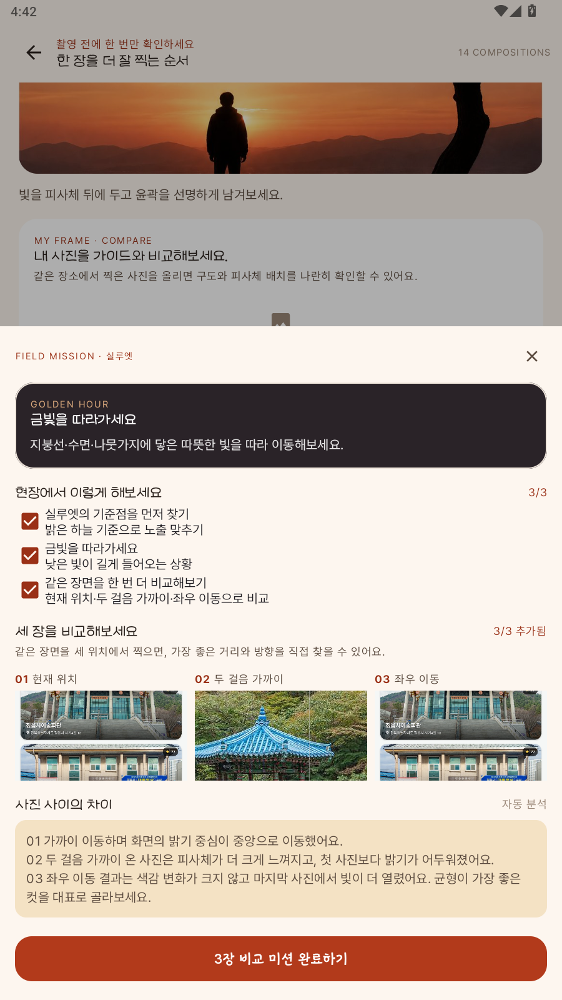

# 📸 정읍 시선 (PicView)

> **"지금 정읍에서, 어디를 어떻게 담을까"**
> 실시간 기상·천문 데이터로 촬영 적기를 계산하는 지역 특화 출사(出寫) 안내 앱

『2026 관광데이터 활용 공모전』 출품작 · Android Native

<p align="center">
  
  
  
</p>

---

## 왜 만들었나

관광 앱은 많습니다. 대부분 **"어디를 갈까"** 까지 답하고 끝납니다.

그런데 사진을 찍으러 가는 사람에게는 그것으로 부족합니다. 같은 내장산이라도
한낮에 가면 빛이 강해 평범한 사진이 나오고, 일몰 30분 전에 가면 단풍이
역광으로 투명하게 빛납니다. **어디를 갈지보다 언제 갈지가 사진을 결정합니다.**

정읍 시선은 **"지금 어디를, 언제, 어떻게 담을까"** 까지 답합니다.

### 왜 정읍인가

정읍은 내장산 단풍철에 관광객이 몰리고 나머지 계절에는 비는 곳입니다.
그런데 출사의 관점으로 보면 정읍에는 사계절이 다 있습니다 — 봄 벚꽃,
여름 계곡, 가을 단풍과 구절초, 겨울 설경. 문제는 **"지금 뭐가 볼 만한지"를
알 방법이 없다는 것**입니다.

그래서 이 앱은 축제 일정이 아니라 **피사체의 절정 시기**를 기준으로 만들었습니다.
(관광공사 API 에 등록된 정읍 축제가 2026년 기준 0건인 현실적 이유도 있습니다)

---

## 핵심 아이디어 — 빛을 계산한다

이 앱의 모든 기능은 **하나의 계산**에서 나옵니다.

```
한국천문연구원 일출·일몰       ─┐
기상청 초단기실황 (기온·습도·풍속) ─┼─→  지금의 빛 구간(LightPhase)  ─→  모든 화면
기상청 단기예보 (시간대별 기온·하늘) ─┤      (새벽·일출·오전·한낮·오후·일몰·저녁·야간)
촬영지의 방위·최적 시간대        ─┘
```

이 값 하나가 홈의 인사말, 촬영지 점수, 코스 배치, 포즈 추천을 전부 바꿉니다.
**같은 장소가 시간에 따라 다른 점수를 받고, 같은 포즈가 시간에 따라 순위가
바뀝니다.**

> 전부 결정론적 계산입니다. LLM 은 여기서 나온 결과를 설명하는 문장만 씁니다.
> 그래서 네트워크가 끊기거나 LLM 이 실패해도 추천 자체는 항상 나옵니다.

---

## 화면별 기능

### 1. 홈 — 지금 나가야 하나


앱을 여는 이유는 하나입니다. **지금 나가야 하는지 아닌지.**
그래서 첫 화면이 그 답부터 합니다.

**① 빛 보고서 (히어로)**

인사말이 아니라 관측 보고서입니다.

- `● 지금 12:58 · 일몰까지 6시간 22분` — 구간 이름만으로는 그 구간이 막
  시작됐는지 끝나가는지 알 수 없습니다. 가장 가까운 태양 사건까지의
  거리가 그 자리를 메웁니다
- **지금은 한낮이에요.** — 구간 이름만 색을 올립니다. 문장 전체가 한 색이면
  눈이 왼쪽부터 읽어 내려가야 답을 만나는데, 궁금한 낱말은 하나뿐입니다
- **다음 출사 적기** — `오늘 18:51, 붉은 빛이 내려앉기 시작해요` +
  `⏱ 다음 촬영 적기까지 5시간 52분`. 해가 진 뒤에는 **내일 새벽**으로
  넘어갑니다. 밤에 앱을 여는 사람이 알고 싶은 건 오늘이 끝났다는 사실이
  아니라 내일 몇 시에 나가야 하는가 입니다
- 오른쪽 위에 **하늘 상태**(`☁ 흐림`). 맑음·흐림은 취향이 아니라 조건입니다.
  맑으면 한낮 하늘이 하얗게 날아가고, 흐리면 온 하늘이 소프트박스가 됩니다

> **카드 바탕색이 지금의 빛을 따라갑니다.** 한낮은 회갈, 오후는 황토,
> 일몰은 붉은색, 야간은 남색. 붉은 카드가 "야간"이라고 말하고 있으면
> 글자와 색이 서로 다른 말을 합니다. 빛을 다루는 앱이라 색 자체가 정보입니다.

**② 오늘의 빛 흐름**

하루 24시간을 호로 눕히고 그 아래에 정읍의 지형을 깔았습니다.
왼쪽은 해가 뜨는 붉은 흙과 떠오르는 해, 가운데는 들과 나무, 오른쪽은
해가 지는 쪽의 푸른 산·물·달·별입니다.

땅은 장식이 아니라 방향입니다. 호의 색이 주황에서 남색으로 넘어가는 것과
땅이 같은 방향을 가리켜서, 그림 어느 쪽을 봐도 하루가 어디로 흐르는지
읽힙니다.

- 여덟 구간이 각자의 색으로 호에 들어갑니다. 골든아워·블루아워는 20~30분
  짜리라 아주 얇은 띠로 나오는데, **그 얇음 자체가 "놓치면 끝"** 을
  말해 주므로 억지로 넓히지 않았습니다
- 아래 4열 2행 격자에 구간 이름과 시각. 지금 구간에는 알약이 깔립니다
- `13시간 29분 동안 빛이 머물러요`

**③ 현재 기온**

`오늘의 기온`이 아니라 **`현재 기온`** 입니다. 초단기실황은 한 시점의
관측값이라 하루 전체를 말하는 이름이 맞지 않습니다.

- 기온 · 체감온도 · 습도를 같은 무게로. 기온만 크게 두면 "지금 나가도
  되나"를 실제로 가르는 것이 습도·바람이라는 점이 가려집니다
- **오늘의 기온 곡선** — 단기예보(`getVilageFcst`)의 시간대별 기온.
  실황은 지금 한 시점만 주므로 "몇 시에 나가면 좋나"에는 답하지 못합니다
- 한 줄 풀이 — `습도가 높아 실제보다 3℃ 더 덥게 느껴져요`.
  1℃ 차이는 말하지 않습니다. 반올림에서 생기는 값이라 근거가 약합니다

**④ 그 아래**


- **빠른 이동 타일 4개** — 출사 코스 · 지도 · 캘린더 · 미션
- **지금 가면 좋은 곳 (LIGHT MATCH)** — 시안대로 개편한 추천 목록입니다.
  카드의 첫 줄이 점수가 아니라 **시각**입니다 — `⏱ 오늘 18:39`,
  지나갔으면 `내일 06:54`로 넘겨 말합니다. 이 목록의 약속이
  "여기가 좋다"가 아니라 **"몇 시에 가면 빛이 맞는다"**이기 때문입니다.
  주제 칩은 사진 위로 올리고, 그 시간의 빛이 무엇을 만드는지 한 줄
  (`자연 풍경은 해질 무렵 색이 가장 깊어져요`)을 달았습니다.
  카드의 **출사 계획에 담기**를 누르면 상세에 들어가지 않고도 한 곳짜리
  출사 일정으로 바로 저장됩니다
- **시선 가이드 배너** — 사진 목록이 "어디를"에 답했으니 바로 아래에서
  "어떻게"로 잇습니다. **시선 가이드 열기**를 누르면 맨 위 추천 장소의
  이름·빛 상태·추천 구도를 들고 시선 가이드로 넘어갑니다

<br clear="right" />


**체감온도는 기상청 식을 그대로 옮겼습니다.**

여름과 겨울이 서로 다른 식을 씁니다. 여름은 습도가, 겨울은 바람이
지배하기 때문입니다. 어느 식을 쓸지는 기온이 아니라 **월**로 가릅니다 —
24℃라도 습도 90%면 땀이 안 마르는데 "25℃ 이상"으로 자르면 그런 날
체감이 기온과 같게 나와 정보가 사라집니다.

필요한 값(기온·습도·풍속)이 모두 초단기실황 **한 번의 응답**에 함께
들어 있어(T1H·REH·WSD) 추가 호출이 없습니다.

<br clear="right" />

### 2. 포토스코어 — 왜 이 점수인지 보여준다


추천 점수는 **근거가 보여야 신뢰**가 생깁니다. 항목별로 펼쳐 보여 줍니다.

| 항목 | 배점 | 무엇을 보는가 |
|---|---|---|
| 빛 구간 적합 | 6~26 | 지금 빛이 **이 장소의** 최적 시간대와 맞는가 |
| 방위 적합 | 0~16 | 해가 있는 쪽과 장소가 바라보는 쪽 (역광·실루엣) |
| 계절 적합 | 0~18 | 단풍·구절초 같은 피사체가 지금 절정인가 |
| 날씨 | -18~+10 | 비·흐림. 실내는 비가 오히려 유리 |
| 소재 폭 | 12~20 | 풍경·인물·접사 중 몇 가지가 되는가 |
| 머무는 여건 | 0~6 | 빛을 기다릴 수 있는 기온인가 |
| 접근성 | 1~4 | 사진 품질이 아니라 실행 가능성 |

> **설계 기록.** 초기 버전은 100점 중 사진과 직결된 항목이 빛 20점뿐이었고,
> 나머지는 *관광공사 정보 갱신일*(10점), *API 에 대표 사진이 있는지*(4점) 같은
> 데이터 품질 지표였습니다. 그래서 점수 근거로 "정보가 최근에 갱신됐어요"가
> 나왔습니다. 사진이 잘 나오는지와 무관한 문장입니다.
> 앱이 이미 갖고 있던 촬영 특성(방위·최적 시간대)과 계절 절정기를 점수의
> 중심으로 옮겼습니다.

<br clear="right" />

### 3. 출사 코스 — 골든아워를 먼저 예약한다

<p>
  
  
</p>

일반 여행 코스는 "영업시간 안에 몇 군데를 넣을까"의 문제입니다.
출사 코스는 **"빛을 언제 어디서 받을까"** 의 문제라 순서가 반대입니다.

1. **골든아워 슬롯을 먼저 예약** — 하루에 두 번뿐이고 30분씩밖에 없습니다
2. 그 슬롯에 **방위가 맞는 곳**을 꽂습니다 (일출↔동향, 일몰↔서향)
3. **한낮에는 실내**를 넣어 강한 빛을 피합니다
4. 남은 시간을 포토스코어·이동거리로 채웁니다

화면은 시안(빛 코스)을 따릅니다.

- **지금, 정읍의 빛 히어로** — "석양까지 58분"과 오늘 골든아워를 크게.
  배경 그림이 빛 구간(일출·낮·석양·블루아워·밤)을 따라 바뀝니다
- **조건 카드 다섯 칸** — 날짜 · 동행 · 체류 시간 · 이동 방법 · 촬영 목적.
  날짜를 바꾸면 그날의 일출·일몰을 천문 API 로 다시 받아옵니다
  (정읍 일몰은 8월 19:26, 12월 17:21 로 두 시간 넘게 차이 납니다).
  동행(혼자·커플·가족·친구)은 체류 시간 배수로 반영됩니다
- **오늘의 출사 코스 미리보기** — 조건을 바꾸는 즉시 다시 계산됩니다.
  카드의 첫 정보가 이름이 아니라 **도착 권장 시각**입니다 — 이 화면의
  약속이 "어디"가 아니라 "몇 시에 가면 빛이 맞는가"라서입니다
- **오늘의 빛 타임라인** — 일출 · 골든아워 · 일몰이 한 줄로 붙습니다


**결과는 빛의 타임라인입니다 (시안).**

왼쪽 축이 시각 + 빛 구간(오후 · 일몰 · 야간)을 색 점과 함께 말하고,
오른쪽 카드에 관광공사 실사진 · 빛 배지(`일몰 골든아워 · 서향`) ·
이동 정보 · 추천 구도가 붙습니다. 축만 훑어도 하루의 빛이 어디로
흐르는지 보이고, 카드를 누르면 그 장소의 상세로 갑니다.

<br clear="right" />

### 4. 촬영지 탐색 — 빛이 맞는 출사

<p>
  
  
  
</p>

탐색을 시안(LIGHT MATCH)대로 개편했습니다. 화면의 첫 물음이
"무엇을 볼까"가 아니라 **"어떤 순서로 볼까"**입니다.

- **약도 미리보기** — 실제 지도를 살아 있는 채로 넣으면 목록 스크롤과
  지도 스크롤이 싸웁니다. 정읍천 물길과 핀만 그린 약도를 두고,
  누르면 진짜 지도로 넘어갑니다
- **정렬 셋** — 추천순(포토스코어) · 거리순(시내 기준 이동 시간) ·
  **빛 좋은 시간순**(그 장소의 빛이 맞는 다음 시각이 가까운 순).
  세 번째가 이 앱의 정렬입니다 — 지금 16시라면 일몰 스팟이 맨 위로
  올라옵니다. 카테고리 필터는 오른쪽 버튼 뒤로 옮겼습니다
- **카드** — 관광공사 실사진 아래에 빛 신호(`일몰 · 따뜻한 사광`) →
  이름 → 이유 → 구도·차로 X분, 그리고 **시선 가이드 열기**.
  카드에서 바로 그 장소의 빛·구도를 들고 시선 가이드로 갑니다
- **촬영지 탐색 지도 (시안)** — 마커의 축이 관광 분류가 아니라
  **촬영 목적**(반사 · 실루엣 · 인물 · 건축선 · 여백)입니다. 위 칩으로
  스토리(달 · 사랑 · 혁명 · 느림 · 계절)와 목적을 거르고, 스토리로 몇 곳이
  남으면 점선 걷기 동선이 이어집니다. 마커를 고르면 아래 시트가
  **왜 지금 가는지**(현재 빛 · 이동 · 체류 · 난이도 · 추천 구성 · 사진가를
  위한 한 줄)부터 답하고, 발견 → 선택 → 촬영 → 기록 → 재계획 단계가
  아래에 붙습니다. 상태줄은 "지금은 석양 · 일몰까지 58분 · 반사 추천"처럼
  지금의 빛을 먼저 말합니다

### 5. 촬영지 상세 — 언제·어디서·어떻게

<p>
  
  
</p>

상세 화면을 시안 기준으로 전면 개편했습니다. 설계 원칙은 하나입니다 —
**화면의 순서가 곧 질문의 순서**여야 한다는 것. 상세 화면에서 사용자가
차례로 묻는 질문은 "여기가 어디지" → "지금 가도 되나" → "몇 시에 가야 하나"
→ "가서 어떻게 찍나"이고, 카드가 그 순서대로 배치됩니다.

**① 히어로 — 사진 위에 이름을 얹는다**

- 장소명 · 주소 · 포토스코어를 **사진 위에** 얹습니다. 사진 아래 흰 여백에
  두면 첫 화면에서 사진과 이름이 분리돼 "이 사진이 그 장소"라는 연결을
  눈이 다시 만들어야 합니다. 아래 스크림을 깔아 어떤 사진에서도 읽힙니다
- 오른쪽 위에 **찜 · 공유 · 길찾기** 동그라미 버튼 셋.
  - **찜** — 하트를 누르면 단말(SharedPreferences)에 저장됩니다. 로그인이
    없는 앱이라 계정 동기화 대신 "내 폰에 남는 목록"으로 설계했습니다
  - **공유** — 장소명 · 주소 · 오늘의 추천 시간이 텍스트로 나갑니다.
    "여기 가자"라는 말에는 **몇 시에 가자**가 함께 실려야 출사 약속이 됩니다
  - **길찾기** — 원래 하단 버튼이었는데 히어로로 올렸습니다. 하단은
    "찍는 일"의 자리이고, 길찾기는 장소를 정하기 전의 일이라서입니다

**② 라이브 날씨 — 어두운 카드 하나**

- `LIVE WEATHER · JEONGEUP` 어두운 카드에 하늘 상태 · 큰 온도 · 체감 · 습도.
  아래 황금시간 카드가 밝은 살구색이라, 같은 톤이면 두 카드가 한 덩어리로
  뭉쳐 보여 일부러 어둡게 갈랐습니다
- 숫자(온도·체감·습도)는 **오른쪽 한 열**에 모읍니다. 체감이 왼쪽 문장에
  섞여 있으면 "지금 몇 도인가"를 두 번 읽게 됩니다
- 왼쪽 문장은 숫자가 못 하는 말을 합니다 — `온 하늘이 소프트박스가 됐어요`.
  출사에서 흐림은 나쁜 날이 아니라 **다른 날**이기 때문입니다

**③ 오늘의 황금시간 — 결론부터, 그래프는 근거로**

- `다음 추천 구간은 저녁 황금시간 18:19–19:19 이에요` 한 줄이 먼저 나오고,
  일출~일몰 호 위에 현재 시각 마커가 찍힙니다. 그래프를 해석해야 결론이
  나오는 화면은 현장에서 쓰이지 않습니다
- 아래 세 칸 — **추천 촬영 시간 · 추천 촬영 대상 · 추천 방향**.
  가운데 칸은 "이 시간에 무엇을 담게 되는가"(`수면 반사와 테라코타빛 장면`)
  입니다. 체감온도를 두던 자리였는데, 위 날씨 카드가 이미 말한 숫자를
  반복하는 대신 시간대별 피사체를 답하게 바꿨습니다
- 방향 칸은 `서향`이 아니라 **`서향 빛`** 입니다. "서향"은 지도의 말이고
  "서향 빛"이 사진의 말입니다. 실내·무관인 곳은 방향이 없으므로 그대로 둡니다

**④ 촬영 가이드 — 구도 · 방향 · 인물 탭**

<p>
  
  
</p>

예전에는 구도·방향·빛이 알약 세 개로 요약만 됐습니다. 이름은 알려 주지만
현장에서 필요한 것은 **"그래서 어떻게 서고 어디를 보나"** 라서, 탭 하나가
질문 하나에 답하도록 폈습니다.

- **구도 탭** — 남의 장소 예시가 아니라 **이 장소의 실제 사진 위에**
  삼분할·대칭·중앙 가이드 선을 얹습니다. "여기서 이렇게"가 되려면 배경이
  여기여야 합니다. 어떤 구도를 보여줄지는 장소 유형과 날씨([WeatherAdviser])가
  정하고, "추천 상황" 한 줄과 다른 구도 제안 칩이 따라붙습니다
- **방향 탭** — "서향"이라는 글자만으로는 몸을 어디로 돌릴지 한 번 더
  생각해야 합니다. **나침반 그림**(커스텀 뷰 `FacingCompassView`)의 네 방위 중
  하나가 켜져 있으면 글자를 해석하는 단계가 사라집니다. 실내·무관인 장소는
  나침반을 빈 채로 두면 "고장난 그림"으로 읽히므로 그림 자체를 뺍니다
- **인물 탭** — 인물 위치(가로 1/3) · 카메라 거리(3–5m) · 빛은 뒤쪽에서.
  번호 셋으로 끝나는 체크리스트입니다. 사람을 세워 두고 읽는 글이라
  세 줄을 넘기지 않았습니다

**⑤ 그 아래**

- **이 장소에서 바로 할 수 있어요** — 이 장소에서 되고, 아직 안 끝났고,
  지금 빛에 맞는 미션 최대 셋 (미션 항목 참조)
- **오늘의 출사 적합도** — 결과 한 줄 + 접이식 근거 (포토스코어 항목 참조)
- **장소 정보 (접이식)** — 역사·건축 설명은 길고 출사 결정에는 쓰이지
  않습니다. 접어 두고 원하는 사람만 폅니다. HTML 태그를 걷어내고 두 문장마다
  문단을 끊고 촬영에 쓸모 있는 낱말에 형광펜을 치는 다듬기는 그대로입니다.
  오디오 가이드(TTS 낭독 · 속도 조절)도 이 안에 있습니다
- **하단 고정 액션바** — 시안대로 **출사 일정 저장 · 촬영 시작** 한 쌍.
  화면 어디에 있든 다음 행동(계획하거나, 지금 찍거나)이 손 닿는 곳에 있습니다

<br clear="right" />

### 6. 포즈 가이드 — 그래서 어떻게 서지


카메라를 켠 순간 실제로 막히는 지점은 구도가 아니라 **"그래서 어떻게 서지"** 입니다.

- **구도 오버레이** — 삼분할 · 대칭축 · 중앙원 (장소 유형에 따라 자동 선택)
- **포즈 6종** — 뒤돌아 걷기 · 점프샷 · 실루엣 · 앉아서 감상 · 하늘 향해 · 손 프레임
- **인원 선택** — 1인 / 2인 / 3~4인 / 5인+

포즈 점수는 **고정값이 아닙니다.** 지금의 빛 · 장소 방위 · 인원으로 매번
다시 계산합니다.

> 고정값이면 한밤중에도 "실루엣"이 1등으로 뜹니다. 실루엣은 해를 등져야
> 성립하므로 그때는 후순위가 맞습니다. 실제로 **야간에는 뒤로 밀리고
> 일몰 골든아워에는 100점 1위로 올라옵니다.**

<br clear="right" />

### 7. 시선 가이드 — 구도를 배우고 그 자리에서 써 본다

<p>
  
  
</p>

웹 시안(GuidePage)을 안드로이드로 옮긴 화면입니다. 포즈 가이드가
"몸을 어떻게"에 답한다면, 시선 가이드는 **"프레임을 어떻게"**에 답합니다.
화면의 순서가 곧 사용 순서입니다 — 오늘의 추천 한 장 → 구도 캐러셀 →
내 사진 비교 → 구도·빛·움직임·체크 → 실전 미션.

- **오늘의 추천 한 장** — 홈에서 넘어온 장소의 말로 시작합니다.
  `정읍 김명관 고택에서 실루엣 구도로 찍어보세요.` 장소의 촬영 특성이
  첫 구도를 정합니다 — 대칭 장소는 대칭으로, 중앙 구도 장소는 프레임 인
  프레임으로, 삼분할 장소는 물가면 반사·해질 무렵이면 실루엣·그 외에는
  리딩라인으로. 상황 칩(맑음·흐림·일출·일몰·야간·비)을 바꾸면 아래 빛
  조언이 함께 바뀝니다
- **구도 14종 캐러셀** — 낮은 각도부터 시점 전환까지. 사진 위에 영어
  구도 코드와 한글 구도명만 얹고, 넘기면 화면의 모든 설명(설명·방향·팁·
  시그널 카드)이 함께 갱신됩니다
- **내 사진 비교** — 같은 장소에서 찍은 사진을 올리면 가이드 컷과
  나란히 놓입니다. 구도는 글이 아니라 **내 사진 옆에 놓고 볼 때**
  가장 빨리 배워집니다
- **구도 · 빛 · 움직임 · 체크 탭** — 체크 탭은 셔터 전 확인 네 가지로
  **촬영 준비도 %**를 채웁니다. 체크리스트를 게이지로 만든 이유는,
  "다 확인했나"가 아니라 "얼마나 남았나"로 물어야 현장에서 넘기지 않고
  하나씩 지우기 때문입니다
- **실전 촬영 미션** — 현장 체크 셋 + **같은 장면을 세 위치(현재 위치 ·
  두 걸음 가까이 · 좌우 이동)에서 찍은 사진 셋**이 다 모여야 완료가
  켜집니다. 세 장이 모이면 픽셀을 직접 읽어(96px 축소 후 밝기·색온도·
  밝기 중심) **사진 사이의 차이를 문장으로** 돌려줍니다 —
  `화면의 밝기 중심이 중앙으로 이동했어요`. LLM 이 아니라 결정론적
  계산이라 오프라인에서도 즉시 나옵니다

> 미션이 "잘 찍었는지"를 판정하지 않습니다. 세 위치를 **비교하게 만드는 것**
> 자체가 미션입니다 — 좋은 자리는 앱이 고르는 게 아니라 세 장을 나란히 본
> 사람이 고릅니다.



### 8. 출사 기록 · 일기


**촬영 → 기록 → 일기 → 공유**가 한 줄로 이어집니다.

- 촬영 화면에서 셔터를 누르면 **자동으로 방문 기록**이 남고 사진이 붙습니다.
  사진을 찍었다는 건 그 자리에 있었다는 뜻이니까요
  (수동 **다녀왔어요** 버튼도 있습니다 — 눈으로만 보고 온 날도 있으니까요.
  상세 화면의 출사 적합도 아래 항상 보이는 자리에 있고, 누르면
  "출사 기록에 담았어요 · 일기 보기" 스낵바가 일기 탭으로 이어 줍니다)
- 하루 단위로 묶여 **일기 초안**이 생성됩니다 (Gemini, 실패 시 템플릿 폴백)
- **그날 찍은 사진 줄**이 함께 붙습니다
- **고치기** — LLM 이 쓴 문장이 사실과 다를 수 있고, 무엇보다 "내 일기"라면
  내가 고칠 수 있어야 합니다
- **오늘의 감정 (시안)** — 따뜻해요 · 평온해요 · 충만해요 · 설레어요.
  일기 본문과 달리 감정은 고르는 것이라 글자로는 안 쓰게 됩니다.
  누르면 그 날짜에 저장됩니다
- **편지지 위의 본문 (시안)** — 일기 본문이 카드보다 한 톤 노란 종이 위에
  앉아 "앱이 만든 정보"가 아니라 "내가 쓴 글"로 읽힙니다. 제목 옆 알약이
  이번 달에 며칠을 기록했는지 말합니다
- **시선이의 다음 추천 (시안)** — 가장 최근 기록 카드 아래에 다음 출사
  한 곳이 붙습니다. `다음에는 빛을 등지고 서보세요` 같은 머리 문장은
  추천 구도가 정하고, 장소는 **이미 다녀온 곳을 뺀 뒤 물가(반사)를
  먼저, 없으면 점수 높은 곳**을 고릅니다. 전부 결정론 계산이고 사진은
  관광공사 실사진입니다. **이 계획으로 출사 준비하기**를 누르면 한 곳짜리
  출사 일정으로 저장됩니다 — 기록이 다음 출사로 이어지는 자리입니다

<br clear="right" />

### 9. 정읍의 순간을 담다 — 포토 프레임 · 네컷

<p>
  
  
</p>

사진은 찍고 끝이 아니라 **남에게 보여 주는 것으로 마무리**됩니다.
그때 "어디서 찍었는지"가 사진에 같이 붙어야 정읍이 알려집니다.

- **테마 장식 폴라로이드** — 이중 금선 · 구름 문양 · 수묵 산세 · 흩어진
  잎을 전부 코드로 그립니다. 장소명 · 날짜 · `전라북도 정읍시 · 내장산
  단풍 명소` 표기까지 미리보기와 저장본이 같은 코드에서 나옵니다
- 테마 4종 — **내장산 단풍 · 무성서원 · 구절초 · 쌍화차 거리**
  (색 이름이 아니라 장소 이름을 씁니다. 고르는 행위가 "어떤 색으로 할까"가
  아니라 "어디서 찍은 사진으로 할까"가 되도록)
- **네컷 사진** — 세로 스트립 네 칸 아래 테마별 표제가 붙습니다
  (`JEONGEUP · AUTUMN LIGHT` — 내장산의 빛을 네 장면으로). 사진이 네 장보다
  적으면 남는 칸은 빈 인화지로 둡니다 — 더 채울 수 있다는 뜻이니까요
- 폴라로이드는 정사각형 출력 — 인스타그램·카카오톡 어디에 올려도 잘리지 않습니다
- 다른 앱에서 **"공유 → 정읍 시선"** 으로 사진을 보낼 수도 있습니다

### 10. 미션 · 스탬프북 — 방문이 아니라 장면을 센다

<p>
  
  
</p>

미션 구조를 다섯 단계에 걸쳐 갈아엎었습니다. 핵심 전환은 하나입니다 —
**"몇 군데 다녀왔나"가 아니라 "어떤 장면을 남겼나"를 센다.**

방문 수를 세는 미션은 관광 스탬프 랠리입니다. 이 앱은 출사 앱이라,
같은 장소라도 황금시간의 실루엣과 잔잔한 아침의 반사는 **다른 장면**으로
세는 것이 맞습니다. 그래서 진행 단위가 `장면 0 / 19`입니다.

- **도메인 재설계** — 미션 판정의 입력이 방문 기록이 아니라
  "언제 · 어디서 · 어떤 빛에서 찍었나"입니다. 별도 완료 플래그를 저장하지
  않고 기록에서 **매번 다시 판정**하므로, "완료 처리를 깜빡해 배지가 안
  나오는" 종류의 버그가 원천적으로 없습니다
- **탐색 화면** — 전체 미션이 수집판(격자)이 아니라 **탐색 목록**입니다.
  맨 위에 **오늘의 추천 미션** 하나 — 지금의 빛과 남은 진행으로 골라
  추천 시간 · 구도 · 방향까지 붙습니다. "다음에 뭘 해볼까"를 고르는 자리와
  "지금 뭘 하지"에 답하는 자리를 갈랐습니다
  - 필터 칩 — **빛 · 날씨 · 계절 · 장소 · 비교 · 기록**. 미션의 성격
    (황금시간을 노리는 것, 물가 반사를 모으는 것, 아침저녁을 비교하는 것)이
    곧 분류입니다
  - 각 미션에 진행 바 · 한 줄 힌트(`바람이 잔잔한 이른 아침에 수면이 가장
    잘 비칩니다`) · 해시태그
- **상세 화면과 연결** — 촬영지 상세에 "이 장소에서 바로 할 수 있어요"로
  이 장소에서 되고 아직 안 끝났고 지금 빛에 맞는 미션이 **최대 셋** 나옵니다.
  같은 missionId 를 쓰므로 거기서 사진을 남기면 전체 진행률도 함께 올라갑니다
- **스탬프북** — 스탬프가 도장 아이콘이 아니라 **손그림 배지**입니다.
  이름도 "미션 3 완료"가 아니라 **황금빛 수집가 · 수면의 관찰자 · 블루아워
  관찰자** 같은 수식어입니다. 모은 것이 숫자가 아니라 호칭이 되도록.
  미획득 배지는 숨기지 않고 **흐리게** 보여 줍니다 — 빈 칸이 아니라
  채울 자리로 읽히게. 상단에 장면 수 · 스탬프 · 다녀온 곳 · 이번 계절 요약

> 원안은 "쌍화차 인증" 같은 단순 방문 미션이었는데, **빛 조건**을 판정에
> 넣었습니다. 그래야 "언제 가느냐"가 의미를 갖고, 이 앱이 스탬프 앱이 아니라
> 출사 앱으로 남습니다.

<br clear="right" />

### 11. 사계절 캘린더


축제가 아니라 **피사체의 절정 시기**가 기준입니다.

- 계절 탭 · 월 달력 · 절정 기간에 점 표시
- 계절을 고르면 **그 계절의 색**으로 켜집니다. 봄은 벚꽃 분홍, 여름은
  내장산 신록의 초록, 가을은 은행잎 주황, 겨울은 얼음의 시린 파랑.
  넷 다 대표색(단풍 빨강)이면 무엇을 골랐는지 색으로 알 수 없고,
  겨울을 골랐는데 칩이 단풍색이 되는 어긋남도 생깁니다
- D-day 안내 (`구절초 개화까지 D-14`)
- 그 시기에 **어떻게 찍는지** 한 줄 팁
- 계절을 고르면 달력이 그 계절로 넘어가되, **지금이 그 계절 안이면 첫 달이
  아니라 이번 달**을 폅니다. 8월에 여름을 열었는데 6월이 나오면 절정 점을
  보러 두 번을 더 넘겨야 합니다

> 절정 기간이 며칠에 걸쳐 있는지는 목록만으로 감이 오지 않습니다.
> "10월 19~21일"을 읽는 것과 달력에서 그 사흘에 점이 찍힌 걸 보는 것은 다릅니다.

<br clear="right" />

### 12. MY — 나의 시선


로그인이 없으므로 프로필(아바타 · 레벨 · 가입일)을 두지 않았습니다.
계정이 아니라 **기록이 곧 프로필**입니다.

- **이번 달의 시선** — 저장한 코스 · 다녀온 장소 · 완성한 미션을
  지난 달 대비와 함께. 전부 로컬 방문 기록에서 계산합니다
- **최근 촬영** — 사진 격자(장소 · 구도 태그). 누르면 포토 프레임으로
  이어집니다
- **나의 촬영 스타일** — 자주 선택한 구도 · 좋아하는 빛 상태 · 선호하는
  장소. 스스로 적은 적 없는 프로필이 기록만으로 만들어집니다
- 저장한 코스 · 이어서 할 미션 요약 카드와 전체보기,
  접근성 · 글씨 크기 · 앱 정보 퀵링크 (고객센터는 두지 않습니다 —
  응대 창구가 없는데 버튼만 있으면 거짓말이 됩니다)

<br clear="right" />

### 13. 온보딩 · 큰 글씨 모드 (시니어 접근성)


온보딩 세 장이 이모지가 아니라 **빛 장면 그림**(석양 · 일출 · 낮)으로
시작합니다 — 첫 화면부터 앱이 쓰는 그림 언어를 미리 보여 줍니다.
로그인·회원가입 단계는 없습니다.

탭 5개 → 3개, 글자·버튼 확대, TTS 0.85배속.
출사는 은퇴 후 취미로 시작하는 사람이 많은 분야라 접근성을 곁다리로 두지
않았습니다.

MY 탭에 **앱 사용법 다시 보기**를 뒀습니다. 온보딩은 처음에 대개 건너뛰는데,
나중에 다시 보고 싶어도 길이 없었습니다. 처음 봤던 화면을 그대로 다시
띄우되, 다시 보기로 열었을 때는 건너뛰기가 설정을 건드리지 않고 조용히
닫힙니다 — **보러 온 것이지 설정하러 온 것이 아니라서**입니다.

---

## 설계 기록 — 갈아엎은 것들

만든 것보다 **버린 것**이 더 많은 것을 설명합니다. 남긴 이유를 적어 둡니다.

### 하루의 빛을 그리는 방법 (세 번 바꿈)

| 시도 | 문제 |
|---|---|
| 가로 막대 | "골든아워까지 얼마 남았나"는 읽히지만 **해가 어디쯤 떠 있나**는 안 보임 |
| 반원 (자정~자정) | 해의 높이가 보이게 됐지만 세로로 높아 **카드가 화면의 3분의 1**을 먹음 |
| 납작한 호 (일출~일몰) | 카드는 짧아졌지만 **새벽·저녁·야간이 그림에서 사라짐** |
| **눕힌 호 + 지형** | 24시간을 다 담되 납작하게. 아래에 땅을 깔아 그림이 되니 높이가 아깝지 않음 |

구간 이름도 세 번 옮겼습니다. 호를 따라 곡선 아래 정확한 위치에 놓아 봤는데,
골든아워·블루아워가 30분짜리라 **왼쪽 끝에 이름 넷이 몰려** 어긋난 높이로
쌓이고 자정 쪽 "야간"은 카드 밖으로 잘렸습니다. 4열 2행 격자로 옮기니
날짜가 바뀌어 구간 길이가 달라져도 자리가 흔들리지 않습니다. 위치로 잇던
이름과 띠는 **색 점**으로 잇습니다.

### 시각 표기에서 딱 두 곳만 다르게

구간 이름 옆의 시각은 **그 구간이 시작하는 시각**입니다. 알고 싶은 것이
"몇 시부터 이 빛인가"라서입니다. 두 곳만 예외입니다.

- **일출·일몰 골든아워** — 시작 시각을 적으면 `05:21`이 되는데, "일출"이라는
  낱말에서 기대하는 숫자는 해가 뜨는 `05:52`입니다. 두 값이 어긋나 보이면
  그림 전체를 못 믿게 됩니다
- **야간** — 자정에 잘려 조각이 둘입니다. 저녁 뒤에 오는 쪽(`20:20`)을 씁니다.
  `00:00`은 "오늘 밤 몇 시부터 야간인가"에 답하지 못합니다

### 색이 곧 정보다

세 군데에서 색을 고정값에서 데이터로 바꿨습니다.

- **히어로 카드 바탕** — 단풍 빨강 고정 → 지금의 빛 구간
- **계절 칩** — 대표색 고정 → 봄 분홍 / 여름 초록 / 가을 주황 / 겨울 파랑
- **새벽·저녁·야간** — `light_night` 한 색을 함께 쓰고 있어 하루의 시작과 끝과
  한밤이 같은 파랑이었습니다. 새벽은 밝아지는 쪽이라 옅게, 저녁은 어두워지는
  쪽이라 짙게 갈랐습니다

호의 구간 색을 히어로 바탕에 그대로 쓸 수는 없었습니다. 오전·한낮의
노랑·회색 위에 흰 글씨를 얹으면 안 읽힙니다. 같은 계열에서 **명도만 낮춘
짝**을 따로 뒀습니다.

### 서체는 자리마다 다르게, 다만 한 곳만 예외

`Display`는 마포백패킹입니다. "정읍 시선" 같은 짧은 이름에는 둥근 맛이
살지만, **한 문장을 큰 글씨로 깔면 획이 뭉쳐** 관측 결과가 아니라 인사말처럼
읽힙니다. 빛 보고서 제목 한 자리만 Pretendard 로 바꿨습니다.
브랜드 이름은 그대로입니다.

### 그림을 이미지로 깔지 않은 이유

참고 시안에는 예쁜 SVG·PNG 가 있었지만 **일출 05:51 / 일몰 19:22 가 그림에
박혀** 있었습니다. 그대로 깔면 매일 같은 시각을 보여 주게 됩니다.
언덕·물·나무·달·별까지 전부 `Canvas` 로 다시 그려 값을 살렸습니다.

### 한국어 어미

`"지금은 야간이에요"` 와 `"지금은 일출 골든아워예요"` 는 어미가 갈립니다.
하나로 고정하면 여덟 구간 중 절반이 어색해지고 앱이 한국어를 모르는 것처럼
보입니다. 한글 음절의 종성 인덱스로 받침을 판정합니다(`util/Korean.kt`).

---

## 기술 스택

| 레이어 | 기술 |
|---|---|
| 언어 / 최소 SDK | Kotlin · minSdk 26 (Oreo) |
| UI | XML + ViewBinding + Material 3 |
| 아키텍처 | MVVM + Repository |
| 카메라 | CameraX (SurfaceView + Canvas 오버레이) |
| 지도 | Naver Maps Android SDK |
| 네트워크 | Retrofit2 + Coroutines |
| 로컬 저장 | Room (저장한 코스 · 방문 기록 · 일기) |
| 이미지 | Glide |
| 문구 생성 | Gemini API (실패 시 템플릿 폴백) |

**로그인이 없습니다.** 모든 기록이 단말에 남고, 통계는 익명 설치 ID로만 묶입니다.

### 타이포그래피

서체마다 역할을 나눴습니다.

| 자리 | 서체 | 라이선스 |
|---|---|---|
| 제목 · 장소명 · 버튼 | 마포백패킹 | 공공누리 1유형 |
| 소제목 | 이서윤체 | 상업적 이용 가능 |
| 본문 · 라벨 | Pretendard | OFL |
| 일기 | 교보손글씨 2025 | 상업적 이용 가능 |
| 스탬프 배지 | 그리운 체리한스푼 | 상업적 이용 가능 |

---

## 프로젝트 구조

```
app/src/main/java/com/youngs/picview/
├── data/
│   ├── api/          Retrofit 서비스 (관광공사·기상청·천문연·Gemini)
│   ├── model/        API 응답 모델
│   ├── local/        Room 엔티티 · DAO
│   └── repository/   코스·일기 저장소
├── domain/
│   ├── light/        일출·일몰 → 빛 구간 계산
│   ├── course/       출사 코스 생성 엔진
│   ├── score/        포토스코어 7팩터
│   ├── spot/         정읍 촬영지 방위·구도 정보
│   ├── pose/         포즈 추천 (빛·방위·인원 기반)
│   ├── guide/        시선 가이드 (구도 14종 · 홈 → 가이드 매핑)
│   ├── frame/        폴라로이드 합성
│   ├── mission/      미션 판정
│   ├── season/       계절별 촬영 적기
│   └── diary/        출사 일기
├── ui/               화면 (탭 5개 + 큰 글씨 모드 3개)
└── util/             좌표·거리, TTS, MediaStore 저장, 설정
```

---

## 빌드

### 방법 A — 안드로이드 스튜디오

```bash
git clone https://github.com/Young-Seok-Kim/pic-view.git
```

프로젝트를 열면 `local.properties` 가 자동 생성됩니다. 그대로 Run 하면 됩니다.

**API 키 없이도 빌드·실행됩니다.** 키가 없는 기능은 자동으로 폴백합니다.
실제 데이터를 보려면 `local.properties` 에 아래를 추가하세요.

```properties
TOUR_API_KEY=한국관광공사_디코딩_키
NAVER_CLIENT_ID=네이버_지도_클라이언트_ID
NAVER_CLIENT_SECRET=네이버_시크릿
KAKAO_NATIVE_APP_KEY=카카오_네이티브_앱_키
GEMINI_API_KEY=제미나이_키
```

> `local.properties` 는 `.gitignore` 에 있어 커밋되지 않습니다.
> **`.env.example` 에는 실제 키를 넣지 마세요.** 이 파일은 무시 대상이 아닙니다.
> 도커용 실제 키는 `.env`(무시 대상)에 둡니다.

### 방법 B — 커맨드라인

JDK 17 + Android SDK + adb 만 있으면 됩니다.

```bash
./scripts/deploy.sh              # 빌드 → 설치 → 스크린샷
./scripts/deploy.sh --release    # R8 난독화 적용
```

### 방법 C — 도커 (빌드 전용)

```bash
cp .env.example .env
docker compose -f docker/docker-compose.yml build
docker compose -f docker/docker-compose.yml run --rm aab
```

자세한 내용은 **[docker/README.md](docker/README.md)**.

### 테스트

```bash
./gradlew testDebugUnitTest
```

출사 코스 계산, 코스 배치 규칙, 미션 판정(장면 세기), 계절 D-day,
촬영 방위·빛 구간 문구, 시선 가이드 구도 매핑 등 52개.

---

## 데이터 출처

- **한국관광공사 국문 관광정보 서비스** — 촬영지 목록·사진·개요 (실시간 호출)
- **기상청 초단기실황**(`getUltraSrtNcst`) — 기온·강수·습도·풍속
- **기상청 단기예보**(`getVilageFcst`) — 시간대별 기온 곡선·하늘 상태
- **한국천문연구원 출몰시각** — 일출·일몰

> 관광 정보는 매번 API 로 받아옵니다. 로컬 DB 에 저장하는 건 사용자가 만든
> 기록(저장한 코스·방문 기록·일기)뿐입니다.
>
> 촬영 지식(방위·구도·절정 시기)은 API 가 제공하지 않아 직접 정리한 값입니다.
> 장소·좌표·사진은 전부 API 실시간 데이터입니다.

---

## 알려진 제약

- **이동 거리·시간은 추정치**입니다. 직선거리에 도로 우회 계수(1.35)를 적용한
  값이며 실제 도로 경로가 아닙니다. 카카오 모빌리티 연동 시 교체 예정입니다.
- **예산 기능이 없습니다.** 관광공사 `detailIntro2` 의 요금 필드를 정읍
  실데이터로 확인해 보니 `무료` · `공연, 전시에 따라 다름` 같은 문장이고,
  음식점 메뉴도 `단풍미락정식` 처럼 이름뿐입니다. 금액이 없으니 예산
  슬라이더를 두면 값을 옮겨도 코스가 바뀌지 않는 장식이 됩니다.
- **정읍 등록 축제가 관광공사 API 에 거의 없습니다**(2026년 0건). 그래서
  캘린더는 축제가 아니라 피사체의 절정 시기를 기준으로 만들었습니다.
- 컨테이너 빌드 결과물은 **서명되지 않습니다**(키스토어 미포함).

진행 상황과 남은 작업은 **[docs/PROGRESS.md](docs/PROGRESS.md)** 를 보세요.
